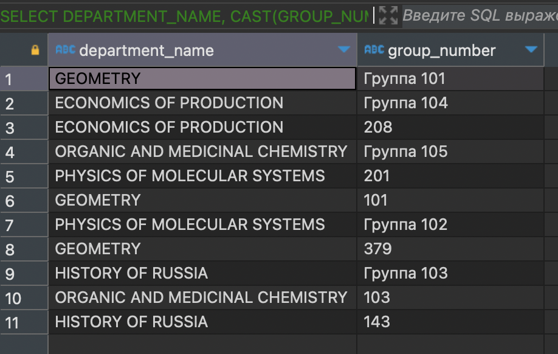
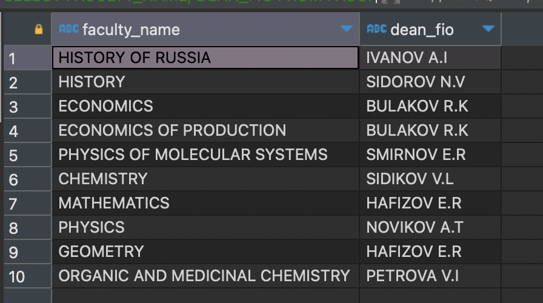
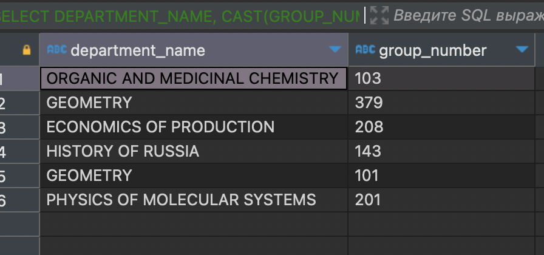
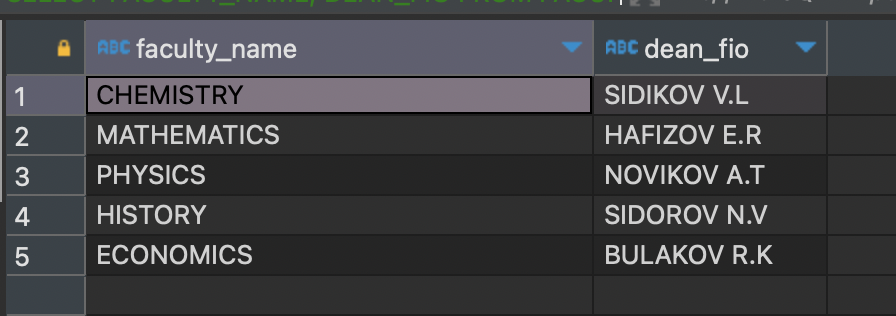
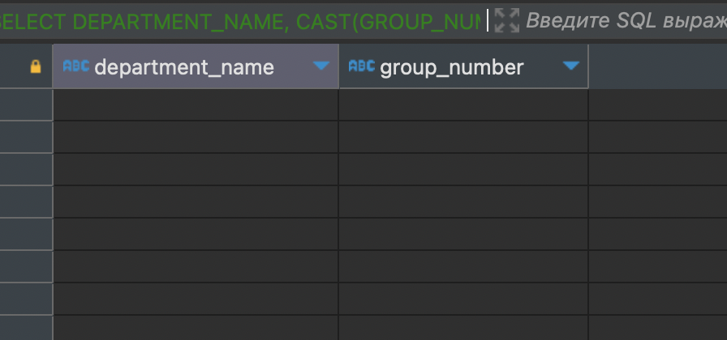
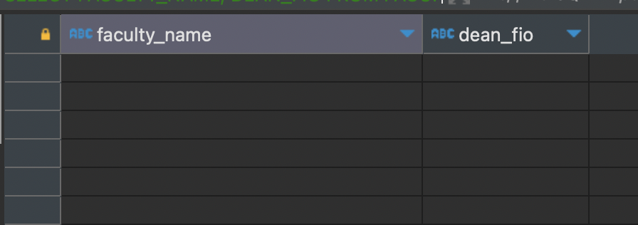

## Содержание

- [UNION](#union)
- [EXCEPT](#except)
- [INTERSECT](#intersect)

---

## UNION

### Получение уникальных групп из таблицы STUDY_GROUPS и STUDENT

```
SELECT DEPARTMENT_NAME, CAST(GROUP_NUMBER AS TEXT) AS GROUP_NUMBER
FROM STUDY_GROUPS
UNION
SELECT DEPARTMENT_NAME, "GROUP"
FROM STUDENT;
```



---

```
SELECT FACULTY_NAME, DEAN_FIO
FROM FACULTIES
UNION
SELECT DEPARTMENT_NAME, MANAGER_FULL_NAME
FROM DEPARTMENTS;
```



---

## EXCEPT

### Нахождение групп из STUDY_GROUPS, которые не встречаются в таблице STUDENT

```
SELECT DEPARTMENT_NAME, CAST(GROUP_NUMBER AS TEXT) AS GROUP_NUMBER
FROM STUDY_GROUPS
EXCEPT
SELECT DEPARTMENT_NAME, "GROUP"
FROM STUDENT;
```



---

```
SELECT FACULTY_NAME, DEAN_FIO
FROM FACULTIES
EXCEPT
SELECT DEPARTMENT_NAME, MANAGER_FULL_NAME
FROM DEPARTMENTS;
```



---

## INTERSECT

### Получение групп, присутствующих и в STUDY_GROUPS и в STUDENT

```
SELECT DEPARTMENT_NAME, CAST(GROUP_NUMBER AS TEXT) AS GROUP_NUMBER
FROM STUDY_GROUPS
INTERSECT
SELECT DEPARTMENT_NAME, "GROUP"
FROM STUDENT;
```



---

```
SELECT FACULTY_NAME, DEAN_FIO
FROM FACULTIES
INTERSECT
SELECT DEPARTMENT_NAME, MANAGER_FULL_NAME
FROM DEPARTMENTS;
```



---