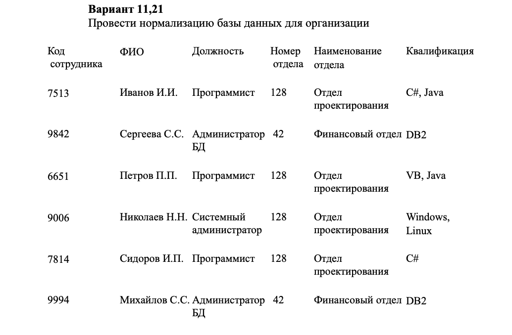
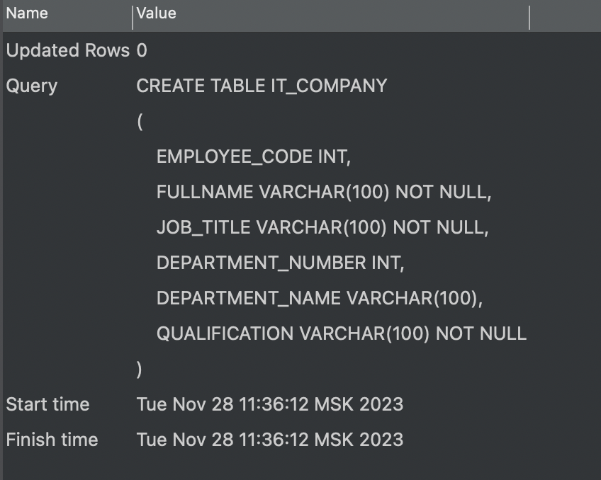
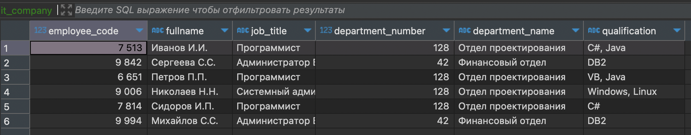
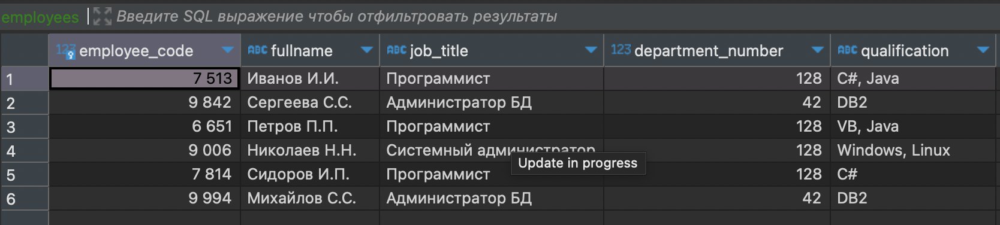
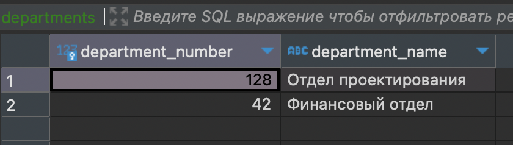
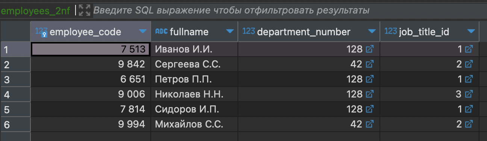
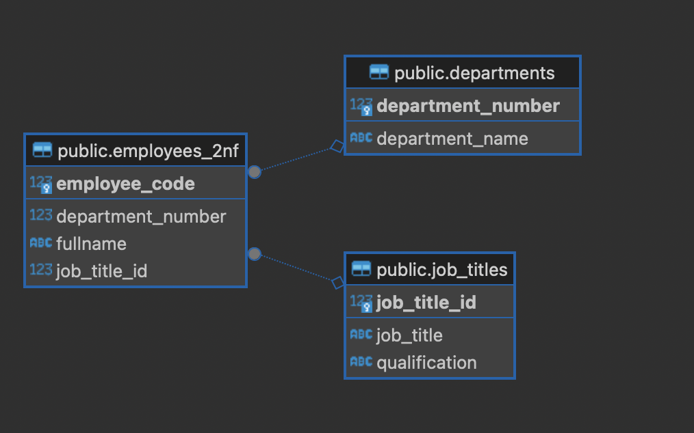

## Содеражание

- [Создание базы данных](#создание-базы-данных)
- [Первая нормальная форма](#первая-нормальная-форма)
- [Вторая нормальная форма](#вторая-нормальная-форма)
- [Третья нормальная форма](#третья-нормальная-форма)
---

## Создание базы данных

Создаем новую базу данных. Для этого необходимо щелкнуть правой кнопкой мыши по разделу ***Базы данных*** -> ***Создать объект "База данных"***. Либо можно использовать сочетание клавиш ( <i style="font-height: 20px; color: #FF8C00;">⌘N</i> ).


Затем откроется окно создания базы данных, в котором прописываем название базы данных (*homework_5*) и нажимаем ***Ок***.


---

## Создание и заполнение таблицы



Для начала создадим тематическую таблицу в базе данных с помощью запроса: 

```
CREATE TABLE IT_COMPANY
(
	EMPLOYEE_CODE INT,
    FULLNAME VARCHAR(100) NOT NULL,
    JOB_TITLE VARCHAR(100) NOT NULL,
    DEPARTMENT_NUMBER INT, 
    DEPARTMENT_NAME VARCHAR(100),
    QUALIFICATION VARCHAR(100) NOT NULL
);
```



Таблица успешно создана, осталось заполнить ее значениями:

```
INSERT INTO it_company (employee_code, fullname, job_title, department_number, department_name, qualification)
VALUES
    (7513, 'Иванов И.И.', 'Программист', 128, 'Отдел проектирования', 'C#, Java'),
    (9842, 'Сергеева С.С.', 'Администратор БД', 42, 'Финансовый отдел', 'DB2'),
    (6651, 'Петров П.П.', 'Программист', 128, 'Отдел проектирования', 'VB, Java'),
    (9006, 'Николаев Н.Н.', 'Системный администратор', 128, 'Отдел проектирования', 'Windows, Linux'),
    (7814, 'Сидоров И.П.', 'Программист', 128, 'Отдел проектирования', 'C#'),
    (9994, 'Михайлов С.С.', 'Администратор БД', 42, 'Финансовый отдел', 'DB2');
```



---

## Первая нормальная форма

Для приведения таблицы к первой нормальной форме нужно избавиться от повторяющихся групп данных. В текущем виде таблица содержит повторяющиеся значения для отделов и их названий. Чтобы исправить это, нужно выделить уникальные отделы в отдельную таблицу.

Вот как можно перепроектировать схему данных:

```
CREATE TABLE EMPLOYEES
(
    EMPLOYEE_CODE INT PRIMARY KEY,
    FULLNAME VARCHAR(100) NOT NULL,
    JOB_TITLE VARCHAR(100) NOT NULL,
    DEPARTMENT_NUMBER INT,
    QUALIFICATION VARCHAR(100) NOT NULL
);

INSERT INTO EMPLOYEES (EMPLOYEE_CODE, FULLNAME, JOB_TITLE, DEPARTMENT_NUMBER, QUALIFICATION)
VALUES
    (7513, 'Иванов И.И.', 'Программист', 128, 'C#, Java'),
    (9842, 'Сергеева С.С.', 'Администратор БД', 42, 'DB2'),
    (6651, 'Петров П.П.', 'Программист', 128, 'VB, Java'),
    (9006, 'Николаев Н.Н.', 'Системный администратор', 128, 'Windows, Linux'),
    (7814, 'Сидоров И.П.', 'Программист', 128, 'C#'),
    (9994, 'Михайлов С.С.', 'Администратор БД', 42, 'DB2');
```



```
CREATE TABLE DEPARTMENTS
(
    DEPARTMENT_NUMBER INT PRIMARY KEY,
    DEPARTMENT_NAME VARCHAR(100)
);

INSERT INTO DEPARTMENTS (DEPARTMENT_NUMBER, DEPARTMENT_NAME)
VALUES
    (128, 'Отдел проектирования'),
    (42, 'Финансовый отдел');

```



Теперь данные разделены на две таблицы: `EMPLOYEES` (сотрудники) и `DEPARTMENTS` (отделы). Каждый отдел имеет уникальный номер и соответствующее ему название, а сотрудники связаны с отделами по номеру отдела.

---

## Вторая нормальная форма

Для приведения сущности ко второй нормальной форме необходимо убедиться, что все атрибуты зависят от первичного ключа целиком, а не только от его части. В настоящий момент таблица `EMPLOYEES` находится в первой нормальной форме.

Если рассматривать таблицу `EMPLOYEES`, то атрибуты `JOB_TITLE` и `QUALIFICATION` зависят от должности сотрудника, а не от его идентификатора (`EMPLOYEE_CODE`). Поэтому, для перевода второй нормальной формы, следует создать отдельную таблицу для должностей и квалификаций.

Пример перехода ко второй нормальной форме:

```
CREATE TABLE EMPLOYEES_2NF (
    EMPLOYEE_CODE INT PRIMARY KEY,
    FULLNAME VARCHAR(100) NOT NULL,
    DEPARTMENT_NUMBER INT,
    JOB_TITLE_ID INT,
    FOREIGN KEY (DEPARTMENT_NUMBER) REFERENCES DEPARTMENTS(DEPARTMENT_NUMBER),
    FOREIGN KEY (JOB_TITLE_ID) REFERENCES JOB_TITLES(JOB_TITLE_ID)
);

INSERT INTO EMPLOYEES_2NF (EMPLOYEE_CODE, FULLNAME, DEPARTMENT_NUMBER, JOB_TITLE_ID)
VALUES
    (7513, 'Иванов И.И.', 128, 1),
    (9842, 'Сергеева С.С.', 42, 2),
    (6651, 'Петров П.П.', 128, 1),
    (9006, 'Николаев Н.Н.', 128, 3),
    (7814, 'Сидоров И.П.', 128, 1),
    (9994, 'Михайлов С.С.', 42, 2);
```



```
CREATE TABLE JOB_TITLES (
    JOB_TITLE_ID INT PRIMARY KEY,
    JOB_TITLE VARCHAR(100) NOT NULL,
    QUALIFICATION VARCHAR(100) NOT NULL
);

INSERT INTO JOB_TITLES (JOB_TITLE_ID, JOB_TITLE, QUALIFICATION)
VALUES
    (1, 'Программист', 'C#, Java'),
    (2, 'Администратор БД', 'DB2'),
    (3, 'Системный администратор', 'Windows, Linux');
```


---

## Третья нормальная форма

Для перехода к третьей нормальной форме необходимо убедиться, что каждый неключевой атрибут зависит только от первичного ключа и не зависит от других неключевых атрибутов.

Сейчас таблица `EMPLOYEES` содержит информацию о `DEPARTMENT_NUMBER`, который связан с конкретным отделом. Мы уже вынесли информацию о должностях и их квалификациях в таблицу `JOB_TITLES`. Однако, есть атрибут `DEPARTMENT_NUMBER`, который может зависеть от других атрибутов отдела, таких как название отдела.

Необходимо обновить таблицу `EMPLOYEES_2NF`, удалив атрибут `DEPARTMENT_NUMBER` из неё и добавив внешний ключ, который будет ссылаться на таблицу `DEPARTMENTS`.

```
ALTER TABLE EMPLOYEES_2NF
ADD COLUMN DEPARTMENT_ID INT;

UPDATE EMPLOYEES_2NF e
SET DEPARTMENT_ID = d.DEPARTMENT_NUMBER
FROM DEPARTMENTS d
WHERE e.DEPARTMENT_NUMBER = d.DEPARTMENT_NUMBER;

ALTER TABLE EMPLOYEES_2NF
ADD FOREIGN KEY (DEPARTMENT_ID) REFERENCES DEPARTMENTS(DEPARTMENT_NUMBER);

ALTER TABLE EMPLOYEES_2NF
DROP COLUMN DEPARTMENT_NUMBER;
```

Этот SQL запрос добавляет новый столбец `DEPARTMENT_ID` в таблицу `EMPLOYEES_2NF`, создает внешний ключ, связывающий его с таблицей `DEPARTMENTS`, затем заполняет `DEPARTMENT_ID` соответствующими значениями из `DEPARTMENTS` и, наконец, удаляет столбец `DEPARTMENT_NUMBER`. Теперь таблица `EMPLOYEES` ссылается на таблицу `DEPARTMENTS` через внешний ключ `DEPARTMENT_ID`, соответствуя третьей нормальной форме.



---


