## Содержание 

- [Создание представлений](#создание-представлений)
  - [Представление для информации о прогрессе студентов](#представление-для-информации-о-прогрессе-студентов)
  - [Представление для сводной информации о студентах](#представление-для-сводной-информации-о-студентах)
  - [Представление для информации о преподавателях](#представление-для-информации-о-преподавателях)
- [Запросы к полученным представлениям](#запросы-к-полученным-представлениям)
  - [Запросы к представлению `StudentProgress`](#запросы-к-представлению-studentprogress)
  - [Запросы к представлению `StudentSummary`](#запросы-к-представлению-studentsummary)
  - [Запросы к представлению `TeacherInfo`](#запросы-к-представлению-teacherinfo)
---

## Создание представлений

#### Представление для информации о прогрессе студентов

```
CREATE VIEW StudentProgress AS
SELECT ST.GROUP_NUMBER, ST.STUDENT_ID, ST.SUBJECT, ST.MARK,
       SS.STUDENT_SURNAME, SS.STUDENT_NAME, SS.STUDENT_PATRONYMIC
FROM PROGRESS ST
JOIN StudentSummary SS ON ST.STUDENT_ID = SS.STUDENT_ID;
```

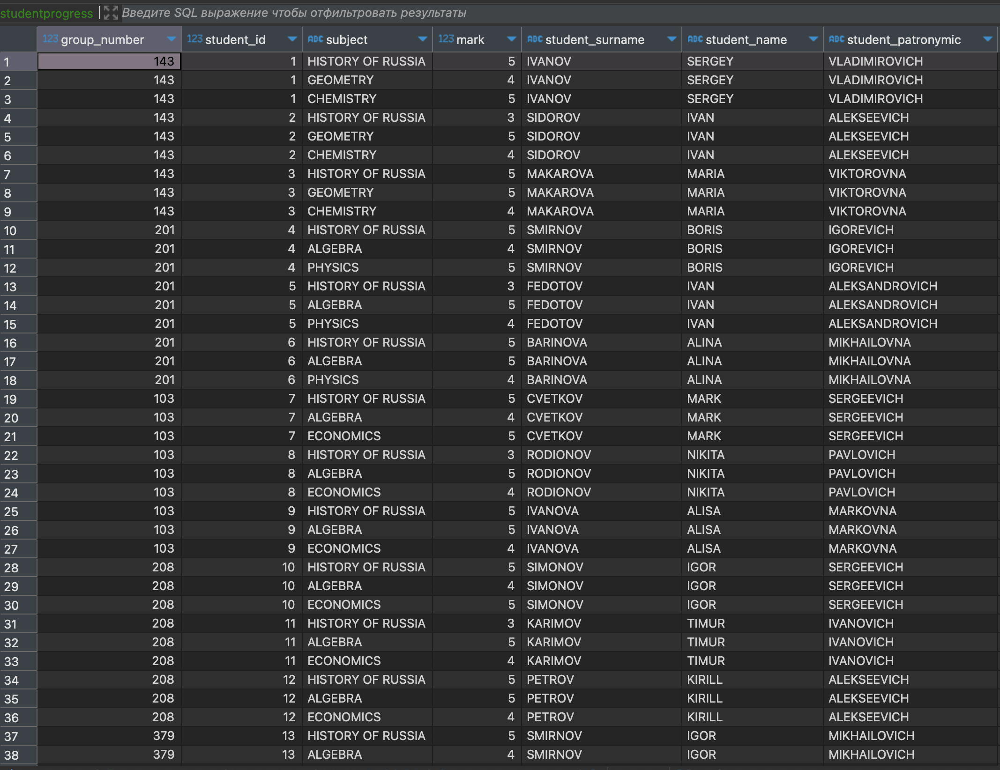

#### Представление для сводной информации о студентах

```
CREATE VIEW StudentSummary AS
SELECT S.STUDENT_ID, S.STUDENT_SURNAME, S.STUDENT_NAME, S.STUDENT_PATRONYMIC,
       S.GENDER, S.ADDRESS, S.CITY, S.PHONE_NUMBER, SG.GROUP_NUMBER,
       SG.ADMISSION_YEAR, SG.STUDY_COURSE
FROM STUDENTS S
JOIN STUDY_GROUPS SG ON S.GROUP_NUMBER = SG.GROUP_NUMBER;
```

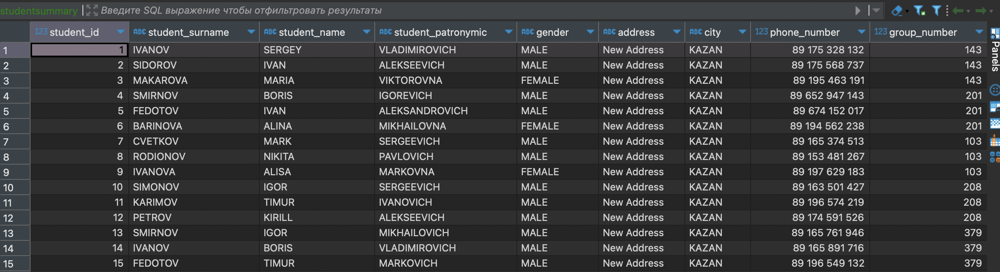

#### Представление для информации о преподавателях

```
CREATE VIEW TeacherInfo AS
SELECT T.KOD_TEACHER, T.NAME_TEACHER, T.DOLGNOST, T.ZVANIE,
       T.SALARY, T.RISE, T.DATA_HIRE, T.BIRTHDAY, T.POL, T.TEL_TEACHER,
       D.DEPARTMENT_NAME
FROM TEACHER T
JOIN DEPARTMENTS D ON T.DEPARTMENT_NAME = D.DEPARTMENT_NAME;
```

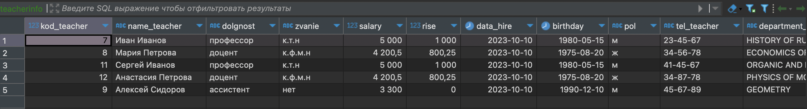

---

## Запросы к полученным представлениям

### Запросы к представлению `StudentProgress`

#### Получение прогресса студента по его ID

```
SELECT *
FROM StudentProgress
WHERE STUDENT_ID = 14;
```

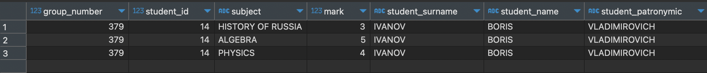

#### Получение списка студентов с оценками по алгебре

```
SELECT *
FROM StudentProgress
WHERE SUBJECT = 'ALGEBRA';
```

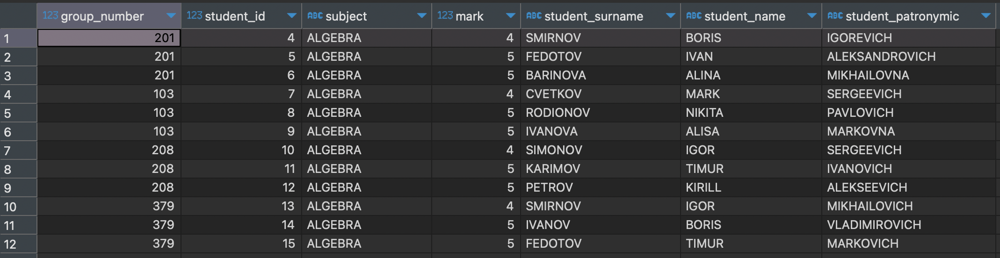

#### Получение средней оценки студентов в каждой группе

```
SELECT GROUP_NUMBER, AVG(MARK) AS AVERAGE_MARK
FROM StudentProgress
GROUP BY GROUP_NUMBER;
```

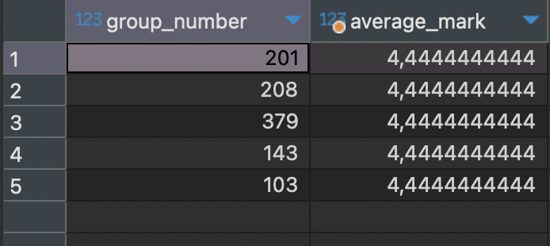

---

### Запросы к представлению `StudentSummary`

#### Получение списка студентов 3 курса и из Казани

```
SELECT *
FROM StudentSummary
WHERE STUDY_COURSE = 3 
AND CITY = 'KAZAN'; 
```

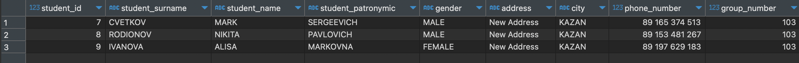

#### Получение информации о студентах, поступивших после 2022 года

```
SELECT *
FROM StudentSummary
WHERE ADMISSION_YEAR > 2022;
```

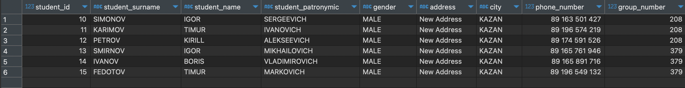

#### Получение количества студентов в каждой группе

```
SELECT GROUP_NUMBER, COUNT(STUDENT_ID) AS STUDENT_COUNT
FROM StudentSummary
GROUP BY GROUP_NUMBER;
```

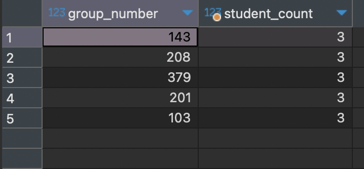

### Запросы к представлению `TeacherInfo`

#### Получение списка преподавателей звания "кандидат технических наук"

```
SELECT *
FROM TeacherInfo
WHERE ZVANIE = 'к.т.н';
```

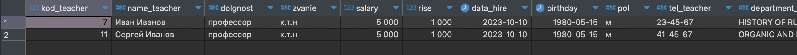

#### Получение списка преподавателей в определенном отделе

```
SELECT *
FROM TeacherInfo
WHERE DEPARTMENT_NAME = 'GEOMETRY'; 
```

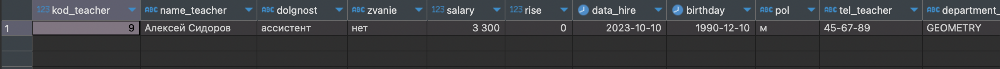

#### Получение информации о преподавателях, принятых после 2022-01-01

```
SELECT *
FROM TeacherInfo
WHERE DATA_HIRE > '2022-01-01';
```

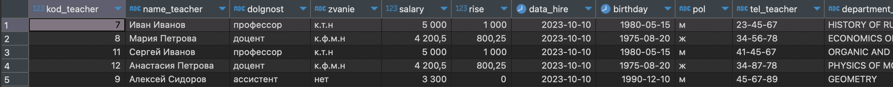

---
