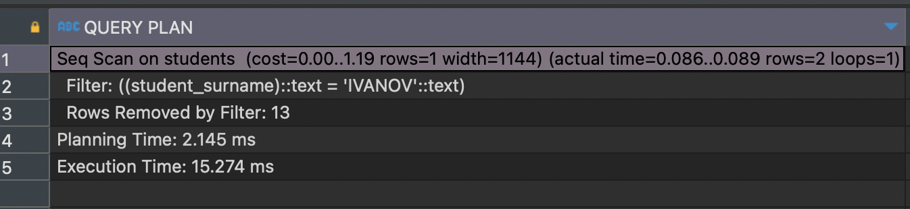
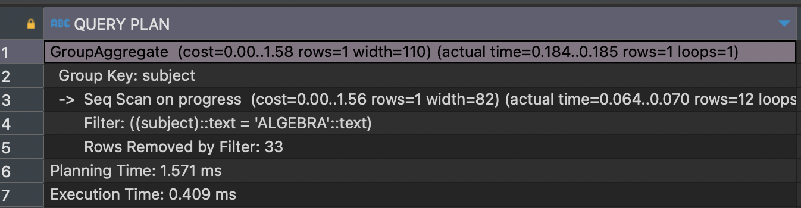
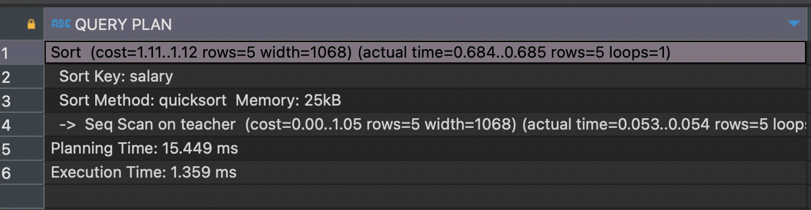
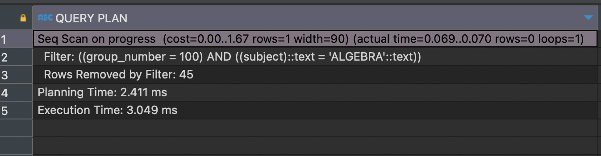
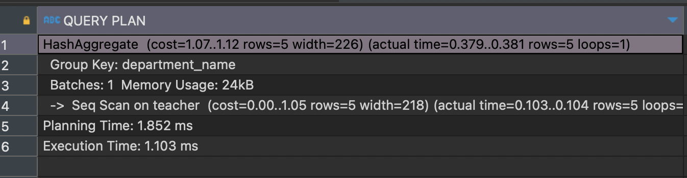
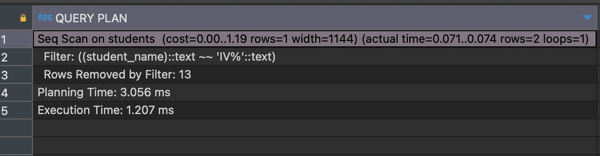
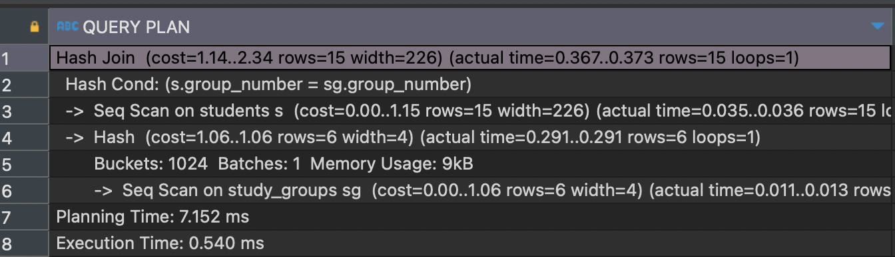

## Содержание

- [Создание индексов различных типов](#создание-индексов-различных-типов)
- [Создание индексов различных категорий](#создание-индексов-различных-категорий)
- [Демонстрация использования индексов для улучшения производительности](#демонстрация-использования-индексов-для-улучшения-производительности)

---

## Создание индексов различных типов

#### Создание индекса B-Tree на столбце STUDENT_SURNAME таблицы STUDENTS
```
CREATE INDEX btree_index_surname ON STUDENTS (STUDENT_SURNAME);
```

#### Создание индекса Hash на столбце DEPARTMENT_NAME таблицы TEACHER
```
CREATE INDEX hash_index_department ON TEACHER USING HASH (DEPARTMENT_NAME);
```

#### Создание индекса B-дерева на колонке, которая часто используется в условиях WHERE
```
CREATE INDEX idx_students_group_number ON STUDENTS(GROUP_NUMBER);
```

#### Создание уникального индекса на колонке, содержащей уникальные значения
```
CREATE UNIQUE INDEX idx_unique_teacher_code ON TEACHER(INDEF_KOD);
```

#### Создание индекса GIN для полнотекстового поиска

```
CREATE INDEX idx_student_name_gin ON STUDENTS USING GIN (STUDENT_NAME gin_trgm_ops);
```

---

## Создание индексов различных категорий

#### Создание индекса для ускорения выборки по диапазону значений
```
CREATE INDEX idx_student_admission_year ON STUDENTS(ADMISSION_YEAR);
```

#### Создание индекса для ускорения выборки с использованием ORDER BY и GROUP BY

```
CREATE INDEX idx_teacher_salary ON TEACHER(SALARY);
```

#### Создание индекса для ускорения поиска по текстовому столбцу

```
CREATE INDEX idx_student_address_city ON STUDENTS(ADDRESS, CITY);
```

---

## Демонстрация использования индексов для улучшения производительности

Без использования индексов:

```
EXPLAIN ANALYZE SELECT * FROM STUDENTS WHERE STUDENT_SURNAME = 'IVANOV';
```



---

С использованием индексов:

```
EXPLAIN ANALYZE SELECT * FROM STUDENTS WHERE GROUP_NUMBER = 123;
```


---

```
EXPLAIN ANALYZE SELECT * FROM TEACHER WHERE INDEF_KOD = 567;
```


---

```
EXPLAIN ANALYZE SELECT SUBJECT, AVG(MARK) FROM PROGRESS WHERE SUBJECT = 'Math' GROUP BY SUBJECT;
```



---

```
EXPLAIN ANALYZE SELECT * FROM TEACHER ORDER BY SALARY;
```



---

```
EXPLAIN ANALYZE SELECT * FROM PROGRESS WHERE GROUP_NUMBER = 100 AND SUBJECT = 'Physics';
```



---

```
EXPLAIN ANALYZE SELECT DEPARTMENT_NAME, COUNT(*) FROM TEACHER GROUP BY DEPARTMENT_NAME;
```



---

```
EXPLAIN ANALYZE SELECT * FROM STUDENTS WHERE STUDENT_NAME LIKE 'IV%';
```



---

```
EXPLAIN ANALYZE SELECT S.STUDENT_ID, S.STUDENT_NAME, SG.GROUP_NUMBER
FROM STUDENTS S
JOIN STUDY_GROUPS SG ON S.GROUP_NUMBER = SG.GROUP_NUMBER;
```



---

Реальные изменения производительности могут варьироваться в зависимости от размера базы данных, объема данных и характера запросов. В большинстве случаев индексы помогают быстрее находить нужную информацию в базе данных. В примерах встречались случаи, где без использования индексов запросы обрабатывались быстрее, чем с ними. Но с большими объемами данных индексы значительно ускоряют обработку тех или иных запросов.