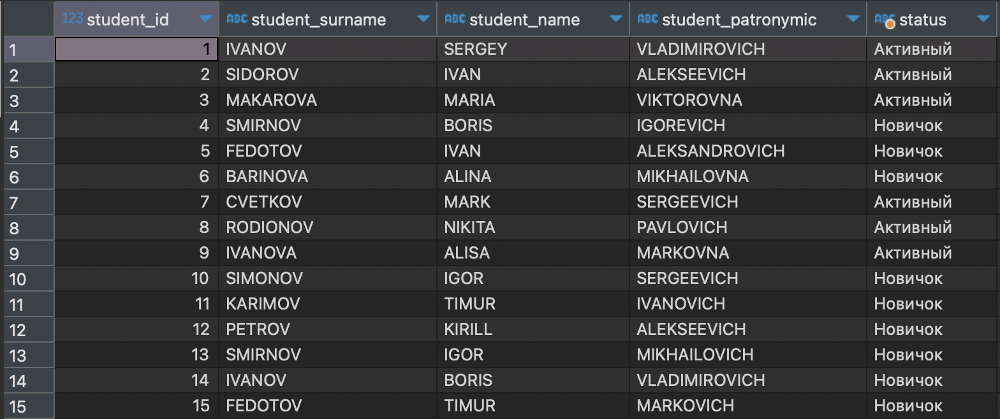
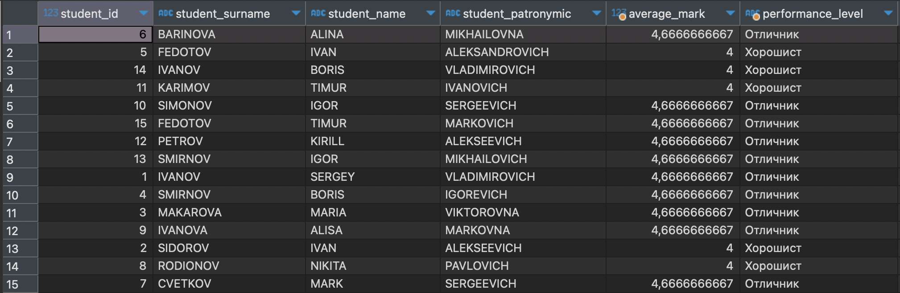
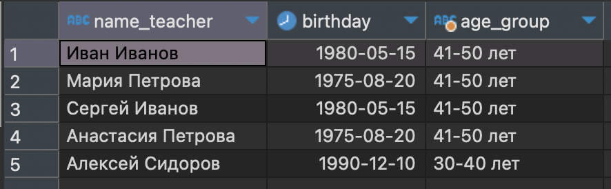
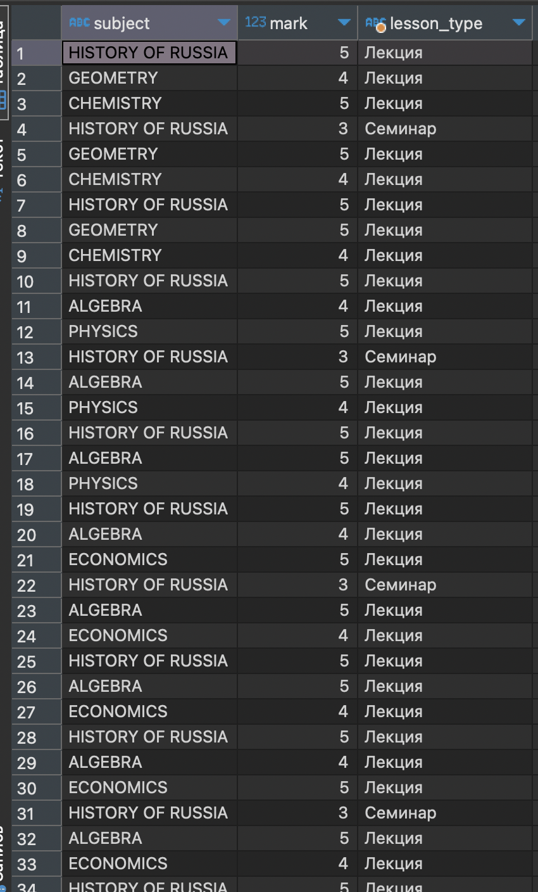

## Содержание

- [Определение статуса студентов (активный/неактивный) в зависимости от курса](#определение-статуса-студентов-активныйнеактивный-в-зависимости-от-курса)
- [Определение уровня успеваемости студентов по оценкам](#определение-уровня-успеваемости-студентов-по-оценкам)
- [Распределение преподавателей по возрастным группам](#распределение-преподавателей-по-возрастным-группам)
- [Определение типа занятия в зависимости от оценки](#определение-типа-занятия-в-зависимости-от-оценки)

---

## Определение статуса студентов (активный/неактивный) в зависимости от курса

```
SELECT
    STUDENT_ID,
    STUDENT_SURNAME,
    STUDENT_NAME,
    STUDENT_PATRONYMIC,
    CASE
        WHEN STUDY_COURSE = 5 THEN 'Выпускник'
        WHEN STUDY_COURSE < 3 THEN 'Новичок'
        ELSE 'Активный'
    END AS STATUS
FROM StudentSummary;
```



---

## Определение уровня успеваемости студентов по оценкам

```
SELECT
    STUDENT_ID,
    STUDENT_SURNAME,
    STUDENT_NAME,
    STUDENT_PATRONYMIC,
    AVG(MARK) AS AVERAGE_MARK,
    CASE
        WHEN AVG(MARK) >= 4.5 THEN 'Отличник'
        WHEN AVG(MARK) >= 3.5 THEN 'Хорошист'
        ELSE 'Удовлетворительно'
    END AS PERFORMANCE_LEVEL
FROM StudentProgress
GROUP BY STUDENT_ID, STUDENT_SURNAME, STUDENT_NAME, STUDENT_PATRONYMIC;
```



---

## Распределение преподавателей по возрастным группам

```
SELECT
    NAME_TEACHER,
    BIRTHDAY,
    CASE
        WHEN DATE_PART('year', AGE(BIRTHDAY)) BETWEEN 30 AND 40 THEN '30-40 лет'
        WHEN DATE_PART('year', AGE(BIRTHDAY)) BETWEEN 41 AND 50 THEN '41-50 лет'
        ELSE 'Старше 50 лет'
    END AS AGE_GROUP
FROM Teacher;
```



---

## Определение типа занятия в зависимости от оценки

```
SELECT
    SUBJECT,
    MARK,
    CASE
        WHEN MARK >= 4 THEN 'Лекция'
        WHEN MARK >= 3 THEN 'Семинар'
        ELSE 'Практическое занятие'
    END AS LESSON_TYPE
FROM PROGRESS;
```



---