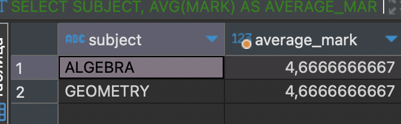
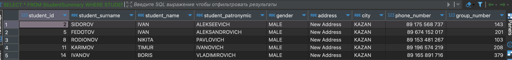
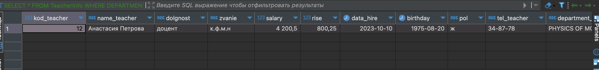
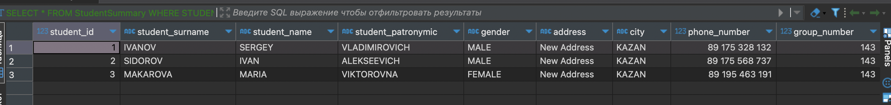

## Содержание

- [Получение средней оценки по каждому предмету](#получение-средней-оценки-по-каждому-предмету)
- [Получение списка студентов и их прогресса, у которых есть 2 и 3](#получение-списка-студентов-и-их-прогресса-у-которых-есть-2-и-3)
- [Получение информации о преподавателях, работающих в отделе с максимальным количеством преподавателей](#получение-информации-о-преподавателях-работающих-в-отделе-с-максимальным-количеством-преподавателей)
- [Получение списка студентов, у которых отсутствуют оценки по алгебре](#получение-списка-студентов-у-которых-отсутствуют-оценки-по-алгебре)

---

## Получение средней оценки по каждому предмету

```
SELECT SUBJECT, AVG(MARK) AS AVERAGE_MARK
FROM PROGRESS
GROUP BY SUBJECT
HAVING AVG(MARK) > (SELECT AVG(MARK) FROM PROGRESS);
```



---

## Получение списка студентов и их прогресса, у которых есть 2 и 3

```
SELECT *
FROM StudentSummary
WHERE STUDENT_ID IN (SELECT STUDENT_ID FROM PROGRESS WHERE MARK <= 3);
```



---

## Получение информации о преподавателях, работающих в отделе с максимальным количеством преподавателей

```
SELECT *
FROM TeacherInfo
WHERE DEPARTMENT_NAME = (
    SELECT DEPARTMENT_NAME
    FROM TEACHER
    GROUP BY DEPARTMENT_NAME
    ORDER BY COUNT(*) DESC
    LIMIT 1
);
```



---

## Получение списка студентов, у которых отсутствуют оценки по алгебре

```
SELECT *
FROM StudentSummary
WHERE STUDENT_ID NOT IN (
    SELECT STUDENT_ID
    FROM PROGRESS
    WHERE SUBJECT = 'ALGEBRA'
);
```



---