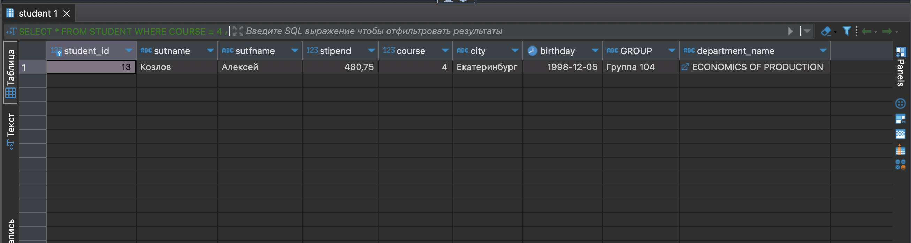

## Содержание

- [Выполнение запросов SQL при помощи SELECT](#выполнение-запросов-sql-при-помощи-select)
    - [Запросы с использованием операторов сравнения и логических операторов AND, OR и NOT](#запросы-с-использованием-операторов-сравнения-и-логических-операторов-and-or-и-not)
    - [Запрос на использование комбинаций логических операций](#запросы-с-использованием-операторов-сравнения-и-логических-операторов-and-or-и-not)

---

## Выполнение запросов SQL при помощи SELECT

> Для получения данных применяется команда SELECT. Подробнее можно почитать [тут](https://metanit.com/sql/sqlserver/4.2.php "select sql").
>  
> Запросы будем выполнять для ранее созданной базы данных *"Университет"*.  
> 
> Для фильтрации в команде SELECT применяется оператор WHERE. 
 После этого оператора ставится условие, которому должна соответствовать строка. Если условие истинно, то строка попадает в результирующую выборку. 
 >
 > В качестве условия можно использовать операции сравнения. Эти операции сравнивают два выражения.  Подробнее можно прочитать [тут](https://metanit.com/sql/sqlserver/4.5.php "where").
> - <span style="color: orange">= </span> : сравнение на равенство  
> - <span style="color: orange"><> </span> : сравнение на неравенство 
> - <span style="color: orange">< </span> : меньше чем
> - <span style="color: orange">> </span> : больше чем
> - <span style="color: orange">!< </span> : не меньше чем
> - <span style="color: orange">!> </span> : не больше чем 
> - <span style="color: orange"><= </span> : меньше чем или равно
> - <span style="color: orange">>= </span> : больше чем или равно    

### Запросы с использованием операторов сравнения и логических операторов AND, OR и NOT

- Выведем факультеты с номером кабинета < 400. Для этого необходимо выполнить следующий запрос:

```
SELECT * FROM FACULTIES WHERE ROOM_NUMBER < 400;
```
В результате должна получиться такая таблица:


---

- Теперь выведем кафедры факультета физики, где число преподавателей не превышает пяти: 

```
SELECT * FROM DEPARTMENTS WHERE FACULTY = 'PHYSICS' AND TEACHER_COUNT <= 5;
```

Результат выполнения запроса:


---

- Напоследок выведем группы студентов, с годом поступления раньше 2022 года, либо с числом студентов, превышающим 30: 

```
SELECT * FROM STUDY_GROUPS WHERE ADMISSION_YEAR < 2022 OR STUDENTS_NUMBER > 30;
```

В результате выполнения такого запроса получится такая таблица: 


- Остальные запросы. Они похожи на предыдущие, поэтому просто покажу запрос и резульат выполнения:

```
SELECT * FROM STUDENT WHERE COURSE = 4 AND STIPEND > 300;
```

Результат: 


---

```
SELECT * FROM TEACHER WHERE SALARY + RISE > 1500;
```


---
 
 ### Запрос на использование комбинаций логических операций

```
SELECT * FROM TEACHER WHERE ZVANIE = 'нет' OR ZVANIE = 'д.ф.м.н';
```

  

---

```
SELECT * FROM STUDY_GROUPS WHERE GROUP_NUMBER IN (208, 143);
```


---

```
SELECT * FROM STUDENTS WHERE GROUP_NUMBER BETWEEN 100 AND 200;
```


---

```
SELECT * FROM PROGRESS WHERE MARK IS NULL;
```


---

```
SELECT * FROM STUDENTS WHERE ADDRESS LIKE '%AVENUE%';
```


---

```
SELECT * FROM FACULTIES WHERE NOT BUILDING_NUMBER = 2;
```


---

```
SELECT * FROM DEPARTMENTS WHERE FACULTY = 'HISTORY' OR FACULTY = 'PHYSICS';
```


---


---

```
SELECT * FROM PROGRESS WHERE SUBJECT LIKE '%GEOMETRY%';
```


---

```
SELECT * FROM STUDENTS WHERE GENDER = 'MALE' AND CITY = 'KAZAN';
```


---

```
SELECT * FROM FACULTIES WHERE PHONE_NUMBER = 89175328132;
```


---

```
SELECT * FROM DEPARTMENTS WHERE ROOM_NUMBER = NULL;
```


---

```
SELECT * FROM STUDENT WHERE COURSE = 4 AND STIPEND > 300;
```



---

```
SELECT * FROM TEACHER WHERE SALARY + RISE > 1500;
```


---

```
SELECT * FROM STUDENT WHERE BIRTHDAY BETWEEN '1995-01-01' AND '2000-12-31';
```


---