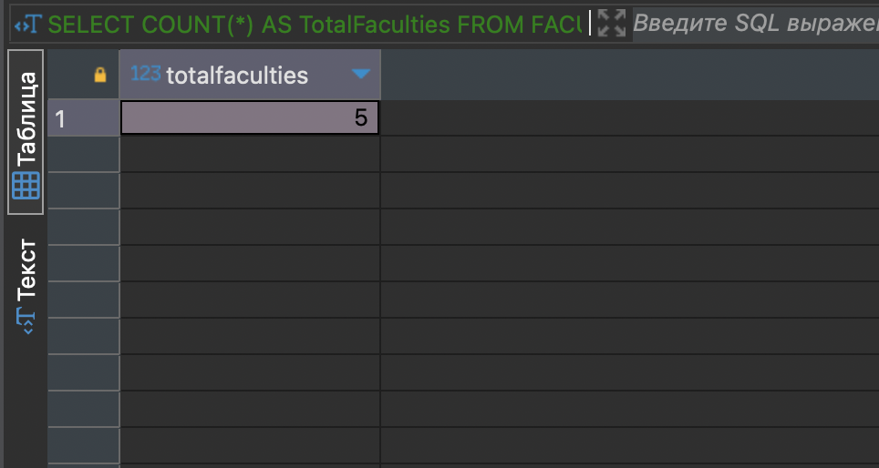
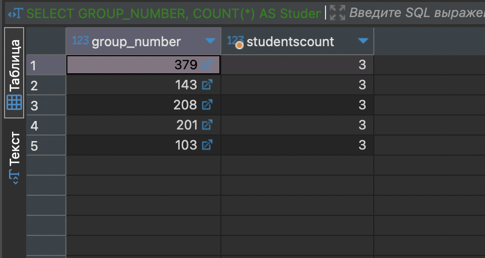
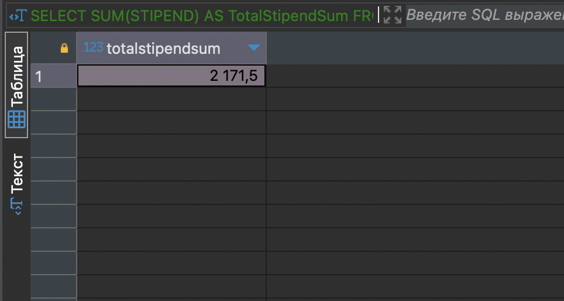
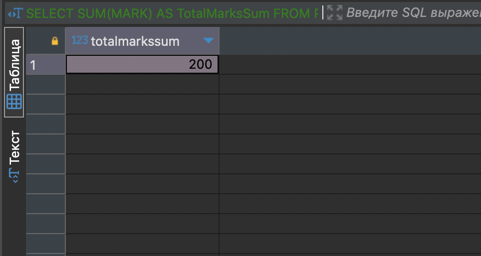
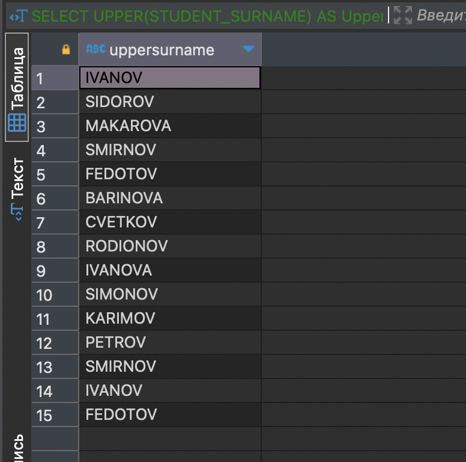
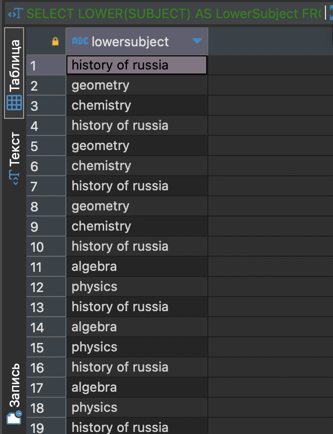
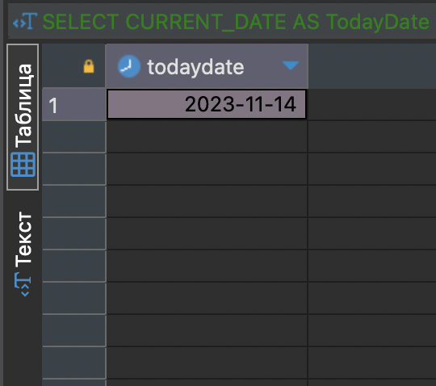
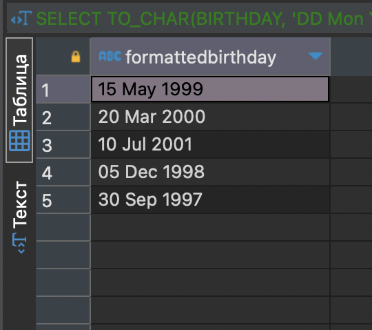
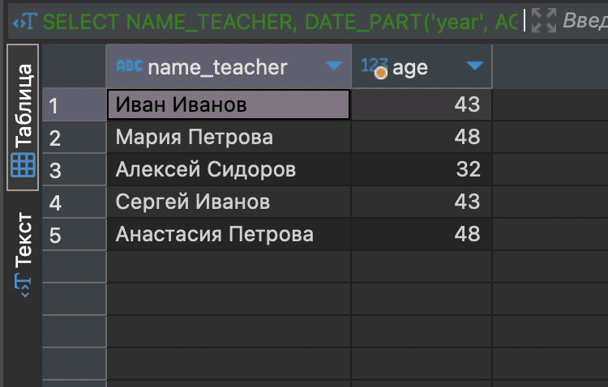
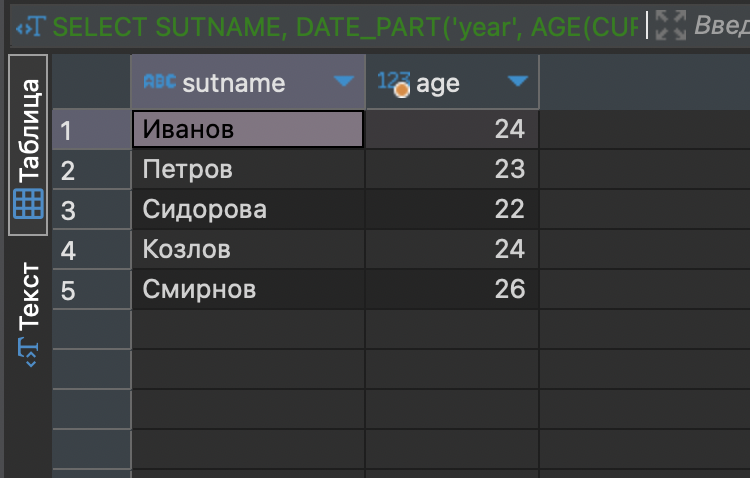

## Содержание

- [Запросы с использованием функции COUNT](#запросы-с-использованием-функции-count)
- [Запросы с использованием функции SUM](#запросы-с-использованием-функции-sum)
- [Запросы с использованием функции UPPER, LOWER](#запросы-с-использованием-функции-upper-lower)
- [Запросы с использованием временных функций](#запросы-с-использованием-временных-функций)
---

## Запросы с использованием функции COUNT

### Подсчет количества факультетов

```
SELECT COUNT(*) AS TotalFaculties
FROM FACULTIES;
```



---

### Подсчет числа студентов в каждой группе

```
SELECT GROUP_NUMBER, COUNT(*) AS StudentsCount
FROM STUDENTS
GROUP BY GROUP_NUMBER;
```



--- 

## Запросы с использованием функции SUM

### Подсчет суммы стипендий всех студентов

```
SELECT SUM(STIPEND) AS TotalStipendSum
FROM STUDENT;
```



---

### Подсчет общего количества оценок по предметам

```
SELECT SUM(MARK) AS TotalMarksSum
FROM PROGRESS;
```



---

## Запросы с использованием функции UPPER, LOWER

### Вывод всех фамилий студентов в верхнем регистре

```
SELECT UPPER(STUDENT_SURNAME) AS UpperSurname
FROM STUDENTS;
```



---

### Вывод всех названий предметов в нижнем регистре

```
SELECT LOWER(SUBJECT) AS LowerSubject
FROM PROGRESS;
```



---

## Запросы с использованием временных функций

### Получение текущей даты

```
SELECT CURRENT_DATE AS TodayDate;
```



---

### Изменение формата даты рождения студентов

```
SELECT TO_CHAR(BIRTHDAY, 'DD Mon YYYY') AS FormattedBirthday
FROM STUDENT;
```



---

### Получение возраста преподавателей

```
SELECT NAME_TEACHER, DATE_PART('year', AGE(DATA_HIRE, BIRTHDAY)) AS Age
FROM TEACHER;
```



### Вычисление возраста студентов на текущую дату

```
SELECT SUTNAME, DATE_PART('year', AGE(CURRENT_DATE, BIRTHDAY)) AS Age
FROM STUDENT;
```



---