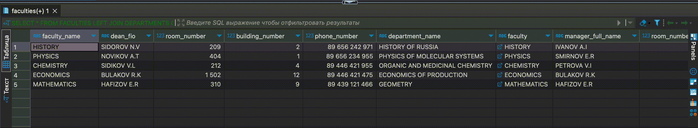
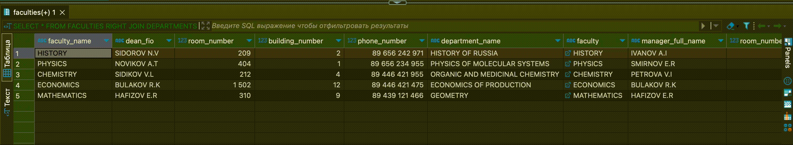
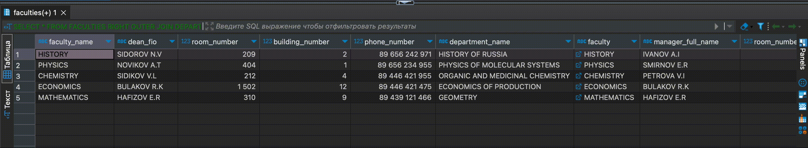
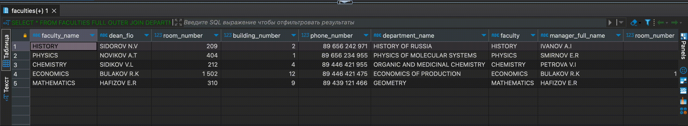

## Содержание 

- [Запрос с использованием декартового произведения двух таблиц](#запрос-с-использованием-декартового-произведения-двух-таблиц)
- [Запросы с использованием соединения двух таблиц по равенству](#запросы-с-использованием-соединения-двух-таблиц-по-равенству)
- [Запрос с использованием соединения двух таблиц по равенству и условием отбора](#запрос-с-использованием-соединения-двух-таблиц-по-равенству-и-условием-отбора)
- [Запрос с использованием соединения по трем таблицам](#запрос-с-использованием-соединения-по-трем-таблицам)
- [Копии ранее созданных запросов на соединение по равенству на запросы с использованием внешнего полного соединения таблиц (JOIN)](#копии-ранее-созданных-запросов-на-соединение-по-равенству-на-запросы-с-использованием-внешнего-полного-соединения-таблиц-join)

---

## Запрос с использованием декартового произведения двух таблиц

Декартово произведение двух таблиц:

```
SELECT *
FROM FACULTIES, DEPARTMENTS;
```


---

## Запросы с использованием соединения двух таблиц по равенству

### Простое внутреннее соединение (INNER JOIN)

```
SELECT *
FROM FACULTIES
INNER JOIN DEPARTMENTS ON FACULTIES.FACULTY_NAME = DEPARTMENTS.FACULTY;
```


---

### Пример LEFT JOIN

```
SELECT *
FROM FACULTIES
LEFT JOIN DEPARTMENTS ON FACULTIES.FACULTY_NAME = DEPARTMENTS.FACULTY;
```



---

### Пример RIGHT JOIN

```
SELECT *
FROM FACULTIES
RIGHT JOIN DEPARTMENTS ON FACULTIES.FACULTY_NAME = DEPARTMENTS.FACULTY;
```



---

## Запрос с использованием соединения двух таблиц по равенству и условием отбора

```
SELECT *
FROM FACULTIES
INNER JOIN DEPARTMENTS ON FACULTIES.FACULTY_NAME = DEPARTMENTS.FACULTY
WHERE DEPARTMENTS.TEACHER_COUNT > 4;
```


---

## Запрос с использованием соединения по трем таблицам

```
SELECT *
FROM FACULTIES
INNER JOIN DEPARTMENTS ON FACULTIES.FACULTY_NAME = DEPARTMENTS.FACULTY
INNER JOIN STUDY_GROUPS ON DEPARTMENTS.DEPARTMENT_NAME = STUDY_GROUPS.DEPARTMENT_NAME;
```


---

## Копии ранее созданных запросов на соединение по равенству на запросы с использованием внешнего полного соединения таблиц (JOIN)

### Внешнее полное соединение (FULL OUTER JOIN)

```
SELECT *
FROM FACULTIES
FULL OUTER JOIN DEPARTMENTS ON FACULTIES.FACULTY_NAME = DEPARTMENTS.FACULTY;
```


---

### Запрос с использованием левого внешнего соединения

```
SELECT *
FROM FACULTIES
LEFT OUTER JOIN DEPARTMENTS ON FACULTIES.FACULTY_NAME = DEPARTMENTS.FACULTY;
```


---

### Запрос на использование правого внешнего соединения

```
SELECT *
FROM FACULTIES
RIGHT OUTER JOIN DEPARTMENTS ON FACULTIES.FACULTY_NAME = DEPARTMENTS.FACULTY;
```



---

### Запрос с использованием симметричного соединения и удаление избыточности

```
SELECT *
FROM FACULTIES
FULL OUTER JOIN DEPARTMENTS ON FACULTIES.FACULTY_NAME = DEPARTMENTS.FACULTY
WHERE FACULTIES.FACULTY_NAME NOTNULL OR DEPARTMENTS.FACULTY NOTNULL;
```



---
