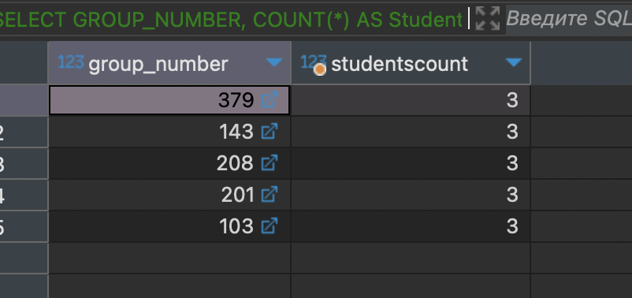

## Содержание

- [Запросы с использованием группировки по одному столбцу](#запросы-с-использованием-группировки-по-одному-столбцу)
- [Запросы на использование группировки по нескольким столбцам](#запросы-на-использование-группировки-по-нескольким-столбцам)
- [Запросы с использованием условия отбора групп HAVING](#запросы-с-использованием-условия-отбора-групп-having)
- [Запросы с использованием сортировки по столбцу](#запросы-с-использованием-сортировки-по-столбцу)
- [Запросы на добавление новых данных в таблицу](#запросы-на-добавление-новых-данных-в-таблицу)
- [Запросы на добавление новых данных по результатам запроса в качестве вставляемого значения](#запросы-на-добавление-новых-данных-по-результатам-запроса-в-качестве-вставляемого-значения)
- [Запросы на обновление существующих данных в таблице](#запросы-на-обновление-существующих-данных-в-таблице)
- [Запросы на обновление существующих данных по результатам подзапроса во фразе WHERE](#запросы-на-обновление-существующих-данных-по-результатам-подзапроса-во-фразе-where)
- [Запросы на удаление существующих данных](#запросы-на-удаление-существующих-данных)

---

## Запросы с использованием группировки по одному столбцу

### Подсчет количества студентов в каждой группе

```
SELECT GROUP_NUMBER, COUNT(*) AS StudentsCount
FROM STUDENTS
GROUP BY GROUP_NUMBER;
```


---

### Подсчет числа преподавателей в каждом отделе

```
SELECT DEPARTMENT_NAME, COUNT(*) AS TeachersCount
FROM TEACHER
GROUP BY DEPARTMENT_NAME;
```


---

## Запросы на использование группировки по нескольким столбцам

### Подсчет количества студентов в каждой группе по полу

```
SELECT GROUP_NUMBER, GENDER, COUNT(*) AS GenderCount
FROM STUDENTS
GROUP BY GROUP_NUMBER, GENDER;
```


---

### Отображение кафедры с менее чем 5 преподавателями

```
SELECT DEPARTMENT_NAME, COUNT(*) AS TeachersCount
FROM DEPARTMENTS
GROUP BY DEPARTMENT_NAME
HAVING COUNT(*) < 5;
```


---

## Запросы с использованием условия отбора групп HAVING

### Вывод групп с менее чем 30 студентами

```
SELECT GROUP_NUMBER, COUNT(*) AS StudentsCount
FROM STUDENTS
GROUP BY GROUP_NUMBER
HAVING COUNT(*) < 30;
```



---

### Отображение отделов с менее чем 5 преподавателями

```
SELECT DEPARTMENT_NAME, COUNT(*) AS TeachersCount
FROM TEACHER
GROUP BY DEPARTMENT_NAME
HAVING COUNT(*) < 5;
```


---

## Запросы с использованием сортировки по столбцу

### Сортировка студентов по фамилии

```
SELECT *
FROM STUDENTS
ORDER BY STUDENT_SURNAME;
```


---

### Сортировка отделов по количеству преподавателей

```
SELECT DEPARTMENT_NAME, COUNT(*) AS TeachersCount
FROM TEACHER
GROUP BY DEPARTMENT_NAME
ORDER BY TeachersCount DESC;
```


---

## Запросы на добавление новых данных в таблицу

### Добавление нового факультета

```
INSERT INTO FACULTIES (FACULTY_NAME, DEAN_FIO, ROOM_NUMBER, BUILDING_NUMBER, PHONE_NUMBER)
VALUES ('New Faculty', 'John Doe', 101, 3, 1234567890);
```


---

### Добавление новой группы студентов

```
INSERT INTO STUDY_GROUPS (DEPARTMENT_NAME, GROUP_NUMBER, ADMISSION_YEAR, STUDY_COURSE, STUDENTS_NUMBER)
VALUES ('GEOMETRY', 101, 2023, 2, 25);
```


---

## Запросы на добавление новых данных по результатам запроса в качестве вставляемого значения

###  Добавление новых преподавателей из другого отдела

```
INSERT INTO TEACHER (DEPARTMENT_NAME, NAME_TEACHER, INDEF_KOD, DOLGNOST, ZVANIE, SALARY)
SELECT 'Computer Science', NAME_TEACHER, INDEF_KOD, DOLGNOST, ZVANIE, SALARY
FROM TEACHER
WHERE DEPARTMENT_NAME = 'Physics';
```


---

### Добавление новых студентов из определенной группы

```
INSERT INTO STUDENTS (STUDENT_SURNAME, STUDENT_NAME, STUDENT_PATRONYMIC, GROUP_NUMBER, GENDER, ADDRESS, CITY, PHONE_NUMBER)
SELECT STUDENT_SURNAME, STUDENT_NAME, STUDENT_PATRONYMIC, GROUP_NUMBER, GENDER, ADDRESS, CITY, PHONE_NUMBER
FROM STUDENTS
WHERE GROUP_NUMBER = 101;
```


---

## Запросы на обновление существующих данных в таблице

### Обновление номера телефона для факультета

```
UPDATE FACULTIES
SET PHONE_NUMBER = 9876543210
WHERE FACULTY_NAME = 'New Faculty';
```


---

### Обновление числа студентов в определенной группе

```
UPDATE STUDY_GROUPS
SET STUDENTS_NUMBER = 30
WHERE GROUP_NUMBER = 101;
```


---

## Запросы на обновление существующих данных по результатам подзапроса во фразе WHERE

### Обновление зарплаты преподавателей в отделе на 10%

```
UPDATE TEACHER
SET SALARY = SALARY * 1.1
WHERE DEPARTMENT_NAME = 'GEOMETRY';
```


---

### Обновление адреса студентов из определенного города

```
UPDATE STUDENTS
SET ADDRESS = 'New Address'
WHERE CITY = 'KAZAN';
```


---

## Запросы на удаление существующих данных

### Удаление факультета

```
DELETE FROM FACULTIES
WHERE FACULTY_NAME = 'New Faculty';
```


---

### Удаление всех студентов из определенной группы

```
DELETE FROM STUDENTS
WHERE GROUP_NUMBER = 101;
```


---