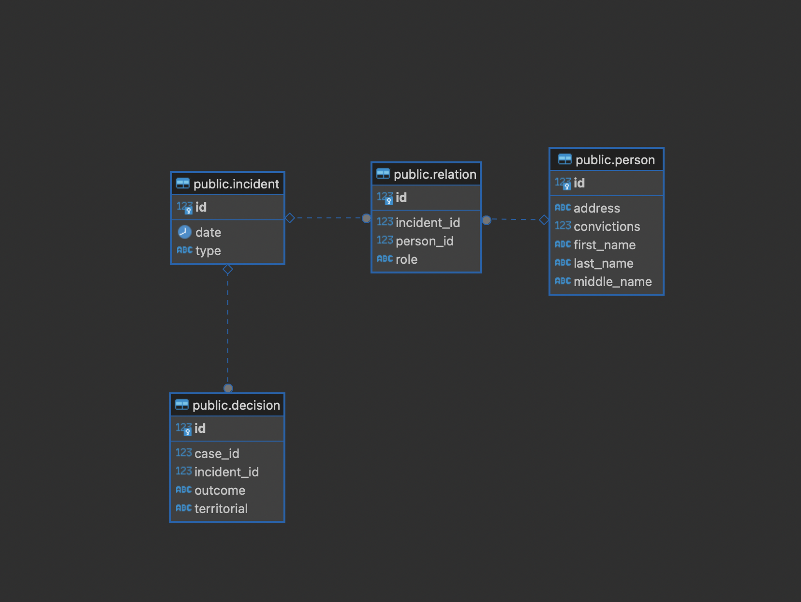
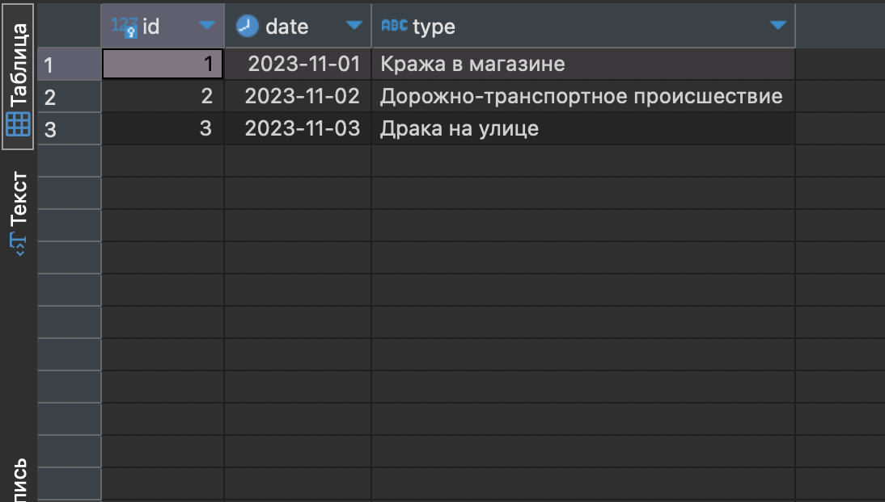
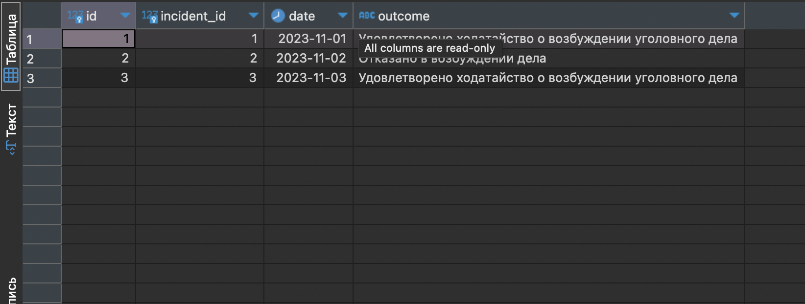
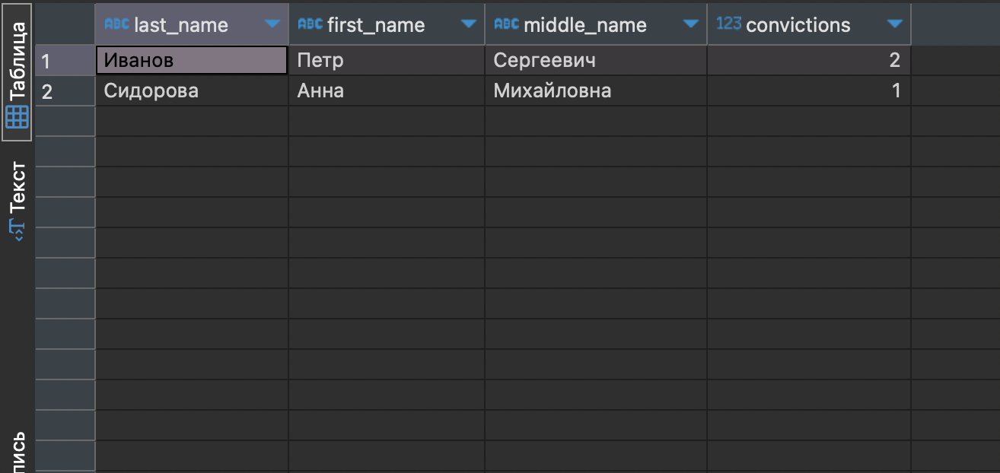
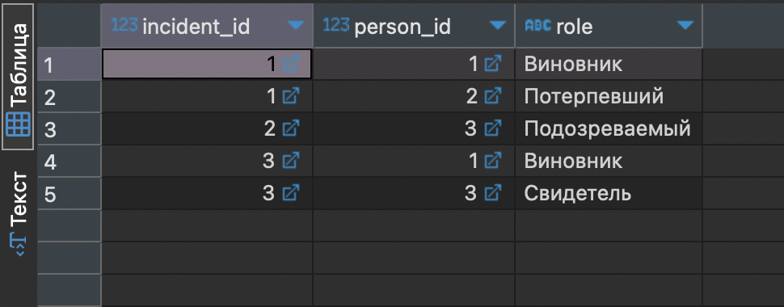
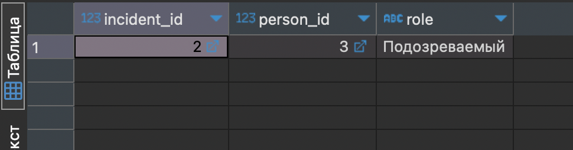
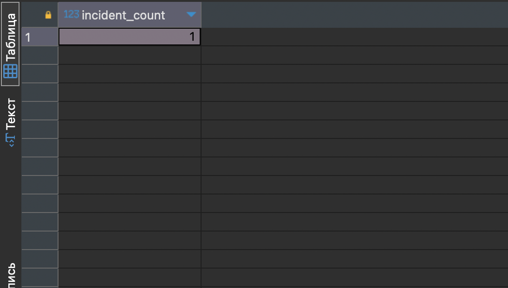

## Содержание 

- [1. Определить сущности, атрибуты, связи. Построить концептуальную модель БД.](#1-определить-сущности-атрибуты-связи-построить-концептуальную-модель-бд)
    - [Сущности](#сущности)
    - [Атрибуты](#атрибуты)
    - [Связи](#связи)
- [2. Задать названия таблиц, атрибутов, определить типы данных, ограничения. Первичные ключи, связи. Построить даталогическую модель.](#2-задать-названия-таблиц-атрибутов-определить-типы-данных-ограничения-первичные-ключи-связи-построить-даталогическую-модель)
    - [Таблицы, атрибуты и типы данных](#таблицы-атрибуты-и-типы-данных)
    - [Даталогическая модель](#даталогическая-модель)
- [3. Написать SQL запросы для создания базы данных и таблиц.](#3-написать-sql-запросы-для-создания-базы-данных-и-таблиц)
    - [Создание базы данных](#создание-базы-данных)
    - [Таблица "Происшествие (Incident)"](#таблица-происшествие-incident)
    - [Таблица "Решение (Decision)"](#таблица-решение-decision)
    - [Таблица "Лицо (Person)"](#таблица-лицо-person)
    - [Таблица "Отношение (Relation)"](#таблица-отношение-relation)
- [4. Написать SQL запросы для выборки данных из одной и нескольких таблиц с пояснением, какая информация извлекается этим запросом.](#4-написать-sql-запросы-для-выборки-данных-из-одной-и-нескольких-таблиц-с-пояснением-какая-информация-извлекается-этим-запросом)
    - [Вывод данных](#вывод-данных)
    - [Рассчет данных о количестве происшествий в указанный промежуток времени](#рассчет-данных-о-количестве-происшествий-в-указанный-промежуток-времени)
    - [Получение для указанного лица количество происшествий, в которых он зарегистрирован](#получение-для-указанного-лица-количество-происшествий-в-которых-он-зарегистрирован)

---

## 1. Определить сущности, атрибуты, связи. Построить концептуальную модель БД.

### Сущности
<span style="padding: 40px">Происшествие (Incident)</span><br>
<span style="padding: 40px">Решение (Decision)</span><br>
<span style="padding: 40px">Лицо (Person)</span><br>
<span style="padding: 40px">Отношение (Relation)</span><br>

### Атрибуты

<b style="padding: 40px">Происшествие (Incident):</b><br><br>
<span style="padding: 60px">ID (первичный ключ)</span><br>
<span style="padding: 60px">Дата регистрации (Date)</span><br>
<span style="padding: 60px">Фабула (Type) - краткое описание происшествия</span><br><br>

<b style="padding: 40px">Решение (Decision):</b><br>

<span style="padding: 60px">ID (первичный ключ)</span><br>
<span style="padding: 60px">Регистрационный номер сообщения (Incident ID)</span><br>
<span style="padding: 60px">Решение (Outcome) - возможные значения: "Отказано в возбуждении дела", "Удовлетворено ходатайство о возбуждении уголовного дела"</span><br>
<span style="padding: 60px">Регистрационный номер заведенного дела (Case ID, NULL если решение - "Отказано")</span><br>
<span style="padding: 60px">Отправлено по территориальному признаку (Territorial)</span><br><br>

<b style="padding: 40px">Лицо (Person):</b><br>

<span style="padding: 60px">ID (первичный ключ)</span><br>
<span style="padding: 60px">Фамилия (Last Name)</span><br>
<span style="padding: 60px">Имя (First Name)</span><br>
<span style="padding: 60px">Отчество (Middle Name)</span><br>
<span style="padding: 60px">Адрес (Address)</span><br>
<span style="padding: 60px">Количество судимостей (Convictions)</span><br><br>

<b style="padding: 40px">Отношение (Relation):</b><br>

<span style="padding: 60px">ID (первичный ключ)</span><br>
<span style="padding: 60px">ID Происшествия (Incident ID)</span><br>
<span style="padding: 60px">ID Лица (Person ID)</span><br>
<span style="padding: 60px">Роль (Role) - возможные значения: "Виновник", "Потерпевший", "Подозреваемый", "Свидетель"</span><br><br>

### Связи

<span style="padding: 40px">Происшествие (Incident) связано с Решением (Decision) отношением один-к-одному (1:1).</span><br>
<span style="padding: 40px">Происшествие (Incident) связано с Лицом (Person) через отношение (Relation) отношением многие-ко-многим (M:N). Отношение (Relation) содержит информацию о роли лица в конкретном происшествии.</span><br>

---

## 2. Задать названия таблиц, атрибутов, определить типы данных, ограничения. Первичные ключи, связи. Построить даталогическую модель.

### Таблицы, атрибуты и типы данных

<b style="padding: 20px">Таблицы:</b><br>

<b style="padding: 40px">Таблица Происшествие (Incident):</b><br>

<i style="padding: 60px">Атрибуты: </i><br>

<span style="padding: 80px">ID (первичный ключ)</span><br>
<span style="padding: 80px"> Date (тип данных DATE)</span><br>
<span style="padding: 80px"> Type (тип данных VARCHAR)</span><br>

<b style="padding: 40px">Таблица Решение (Decision):</b><br>

<i style="padding: 60px">Атрибуты: </i><br>

<span style="padding: 80px">ID (первичный ключ)</span><br>
<span style="padding: 80px">Incident_ID (внешний ключ, ссылается на Incident.ID)</span><br>
<span style="padding: 80px">Outcome (тип данных VARCHAR)</span><br>
<span style="padding: 80px">Case_ID (тип данных INTEGER), Territorial (тип данных VARCHAR)</span><br>

<b style="padding: 40px">Таблица Лицо (Person):</b><br>

<i style="padding: 60px">Атрибуты: </i><br>

<span style="padding: 80px">ID (первичный ключ)</span><br>
<span style="padding: 80px">Last_Name (тип данных VARCHAR)</span><br>
<span style="padding: 80px">First_Name (тип данных VARCHAR)</span><br>
<span style="padding: 80px">Middle_Name (тип данных VARCHAR)</span><br>
<span style="padding: 80px">Address (тип данных VARCHAR)</span><br>
<span style="padding: 80px">Convictions (тип данных INTEGER)</span><br>

<b style="padding: 40px">Таблица Отношение (Relation):</b><br>

<i style="padding: 60px">Атрибуты: </i><br>

<span style="padding: 80px">ID (первичный ключ)</span><br>
<span style="padding: 80px">Incident_ID (внешний ключ, ссылается на Incident.ID)</span><br>
<span style="padding: 80px">Person_ID (внешний ключ, ссылается на Person.ID), Role (тип данных VARCHAR)</span><br>

### Даталогическая модель



---

## 3. Написать SQL запросы для создания базы данных и таблиц.

### Создание базы данных.

```
CREATE DATABASE IncidentDatabase;
```

---

### Таблица "Происшествие (Incident)"

```
CREATE TABLE Incident (
    ID SERIAL PRIMARY KEY,
    Date DATE,
    Type VARCHAR
);
```

Заполнение таблицы данными:  

```
INSERT INTO Incident (Date, Type)
VALUES
    ('2023-11-01', 'Кража в магазине'),
    ('2023-11-02', 'Дорожно-транспортное происшествие'),
    ('2023-11-03', 'Драка на улице');
```

---

### Таблица "Решение (Decision)"

```
CREATE TABLE Decision (
    ID SERIAL PRIMARY KEY,
    Incident_ID INT REFERENCES Incident(ID),
    Outcome VARCHAR,
    Case_ID INT,
    Territorial VARCHAR
);
```

Заполнение таблицы данными: 

```
INSERT INTO Decision (Incident_ID, Outcome, Case_ID, Territorial)
VALUES
    (1, 'Удовлетворено ходатайство о возбуждении уголовного дела', 101, 'Местный суд'),
    (2, 'Отказано в возбуждении дела', NULL, 'Районный суд'),
    (3, 'Удовлетворено ходатайство о возбуждении уголовного дела', 102, 'Местный суд');
```

---

### Таблица "Лицо (Person)"

```
CREATE TABLE Person (
    ID SERIAL PRIMARY KEY,
    Last_Name VARCHAR,
    First_Name VARCHAR,
    Middle_Name VARCHAR,
    Address VARCHAR,
    Convictions INT
);
```

Заполнение таблицы данными:  

```
INSERT INTO Person (Last_Name, First_Name, Middle_Name, Address, Convictions)
VALUES
    ('Иванов', 'Петр', 'Сергеевич', 'ул. Ленина, 123', 2),
    ('Петров', 'Игорь', 'Андреевич', 'ул. Советская, 45', 0),
    ('Сидорова', 'Анна', 'Михайловна', 'пр. Гагарина, 67', 1);
```

### Таблица "Отношение (Relation)"

```
CREATE TABLE Relation (
    ID SERIAL PRIMARY KEY,
    Incident_ID INT REFERENCES Incident(ID),
    Person_ID INT REFERENCES Person(ID),
    Role VARCHAR
);
```

Заполнение таблицы данными:

```
INSERT INTO Relation (Incident_ID, Person_ID, Role)
VALUES
    (1, 1, 'Виновник'),
    (1, 2, 'Потерпевший'),
    (2, 3, 'Подозреваемый'),
    (3, 1, 'Виновник'),
    (3, 3, 'Свидетель');
```
---

## 4. Написать SQL запросы для выборки данных из одной и нескольких таблиц с пояснением, какая информация извлекается этим запросом.

### Вывод данных

Извлечение всех происшествий и их даты регистрации:

```
SELECT ID, Date, Type
FROM Incident;
```



Извлечение решений по происшествиям, включая их регистрационные номера и решения

```
SELECT Decision.ID, Incident.ID AS Incident_ID, Date, Outcome
FROM Decision
INNER JOIN Incident ON Decision.Incident_ID = Incident.ID;
```



Извлечение лиц с указанием фамилии, имени, отчества и количества судимостей

```
SELECT Last_Name, First_Name, Middle_Name, Convictions
FROM Person
WHERE Convictions > 0;
```



Извлечение отношений между лицами и происшествиями, включая роли

```
SELECT Incident_ID, Person_ID, Role
FROM Relation;
```



Извлечение отношений между лицами и происшествиями, где роль "Подозреваемый"

```
SELECT Incident_ID, Person_ID, Role
FROM Relation
WHERE role = 'Подозреваемый'
```



### Рассчет данных о количестве происшествий в указанный промежуток времени

```
SELECT COUNT(*) AS Incident_Count
FROM Incident
WHERE Date BETWEEN '2023-11-01' AND '2023-12-01'
```


---

### Получение для указанного лица количество происшествий, в которых он зарегистрирован

```
SELECT COUNT(*) AS Incident_Count
FROM Relation
WHERE Person_ID = 2;
```


