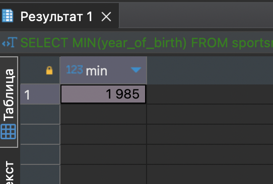
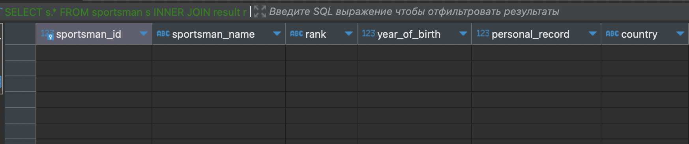

# Контрольная работа (17 вариант)

## Содержание 

- [База данных "Соревнования"](#база-данных-соревнования)
    - [Создание таблиц "competition", "result", "sportsman"](#создание-таблиц-competition-result-sportsman)
    - [Заполнение таблиц "competition", "result", "sportsman" данными](#заполнение-таблиц-competition-result-sportsman-данными)
    - [Запросы по заданию для таблиц "competition", "result", "sportsman"](#запросы-по-заданию-для-таблиц-competition-result-sportsman)
        - [Выберите названия всех соревнований, у которых мировой рекорд равен 15 с и дата установки рекорда не равна 12-02-2015](#выберите-названия-всех-соревнований-у-которых-мировой-рекорд-равен-15-с-и-дата-установки-рекорда-не-равна-12-02-2015)
        - [Вычислите минимальный год рождения спортсменов, которые имеют 1 разряд](#вычислите-минимальный-год-рождения-спортсменов-которые-имеют-1-разряд)
        - [Выведите данные о спортсменах, у которых персональный рекорд совпадает с мировым](#выведите-данные-о-спортсменах-у-которых-персональный-рекорд-совпадает-с-мировым)
        - [Измените страну у спортсменов, у которых разряд равен 1 или 2, с Италии на Россию](#измените-страну-у-спортсменов-у-которых-разряд-равен-1-или-2-с-италии-на-россию)
        - [Выдайте наименование и мировые результаты по всем соревнованиям](#выдайте-наименование-и-мировые-результаты-по-всем-соревнованиям)
- [База данных "Магазин"](#база-данных-магазин)
    - [Создание таблиц "salespeople", "customers", "orders"](#создание-таблиц-salespeople-customers-orders)
    - [Заполнение таблиц "salespeople", "customers", "orders" данными](#заполнение-таблиц-salespeople-customers-orders-данными)
    - [Запросы по заданию для таблиц "salespeople", "customers", "orders"](#запросы-по-заданию-для-таблиц-salespeople-customers-orders)
        - [Что будет выведено в результате запроса select* ...](#что-будет-выведено-в-результате-запроса-select)
        - [Запрос, который выведет имена продавца и заказчика для каждого заказа после номера заказа](#запрос-который-выведет-имена-продавца-и-заказчика-для-каждого-заказа-после-номера-заказа)
        - [Запрос, использующий оператор EXISTS, чтобы извлечь всех продавцов, имеющих заказчиков с оценкой 300](#запрос-использующий-оператор-exists-чтобы-извлечь-всех-продавцов-имеющих-заказчиков-с-оценкой-300)
        - [Создание таблицы заказов с уникальными значениями полей onum, cnum, snum, и исключением значений NULL из поля odate](#создание-таблицы-заказов-с-уникальными-значениями-полей-onum-cnum-snum-и-исключением-значений-null-из-поля-odate)
        - [Создание представления, показывающего всех заказчиков с самыми высокими оценками](#создание-представления-показывающего-всех-заказчиков-с-самыми-высокими-оценками)
        
---

## База данных "Соревнования"

### Создание таблиц "competition", "result", "sportsman"

Для создания всех трех таблиц вводим такие запросы:

```
-- Создание таблицы competition
CREATE TABLE competition (
    competition_id SERIAL PRIMARY KEY,
    competition_name VARCHAR(100),
    world_record DECIMAL(10, 2),
    set_date DATE
);
```

```
-- Создание таблицы result
CREATE TABLE result (
    competition_id INT REFERENCES competition(competition_id),
    sportsman_id SERIAL PRIMARY KEY,
    result DECIMAL(10, 2),
    city VARCHAR(100),
    hold_date DATE
);
```

```
-- Создание таблицы sportsman
CREATE TABLE sportsman (
    sportsman_id SERIAL PRIMARY KEY,
    sportsman_name VARCHAR(100),
    rank VARCHAR(50),
    year_of_birth INT,
    personal_record DECIMAL(10, 2),
    country VARCHAR(100)
);
```

Далее необходимо будет заполнить таблицы данными.

---

### Заполнение таблиц "competition", "result", "sportsman" данными 

Далее заполним таблиц значениями, чтобы проверить правильность следующих запросов:

```
-- Заполнение таблицы competition
INSERT INTO competition (competition_name, world_record, set_date)
VALUES ('Соревнование 1', 9.81, '2023-01-15'),
       ('Соревнование 2', 19.5, '2023-02-28'),
       ('Соревнование 3', 42.2, '2023-04-10');
```

```
-- Заполнение таблицы sportsman
INSERT INTO sportsman (sportsman_name, rank, year_of_birth, personal_record, country)
VALUES ('Иван Иванов', 'Мастер спорта', 1990, 9.85, 'Россия'),
       ('Петр Петров', 'Кандидат в мастера спорта', 1995, 10.05, 'Россия'),
       ('John Smith', 'Master', 1985, 9.79, 'USA');
```

```
-- Заполнение таблицы result
INSERT INTO result (competition_id, sportsman_id, result, city, hold_date)
VALUES (1, 2, 10.00, 'Санкт-Петербург', '2023-01-20'),
       (2, 3, 9.81, 'New York', '2023-03-05'),
       (3, 1, 9.79, 'Сочи', '2023-04-15')
```

После создания таблиц и заполнения их данными можно выполнять запросы из задания.

---

### Запросы по заданию для таблиц "competition", "result", "sportsman" 

Для проверки пришлось добавить еще значений в таблицы (делал все на скорую руку, так что некоторые значения могут совпадать).

#### Выберите названия всех соревнований, у которых мировой рекорд равен 15 с и дата установки рекорда не равна 12-02-2015

```
SELECT competition_name
FROM competition
WHERE world_record = 15 AND set_date != '2015-02-12';
```


---

#### Вычислите минимальный год рождения спортсменов, которые имеют 1 разряд

```
SELECT MIN(year_of_birth)
FROM sportsman
WHERE rank = '1 разряд';
```



---


#### Выведите данные о спортсменах, у которых персональный рекорд совпадает с мировым

Таких значений в моих таблицах не нашлось

```
SELECT s.*
FROM sportsman s
INNER JOIN result r ON s.sportsman_id = r.sportsman_id
INNER JOIN competition c ON r.competition_id = c.competition_id
WHERE s.personal_record = c.world_record;
```



---

#### Измените страну у спортсменов, у которых разряд равен 1 или 2, с Италии на Россию

```
UPDATE sportsman
SET country = 'Россия'
WHERE rank IN ('1 разряд', '2 разряд') AND country = 'Италия';
```

Было: 


Стало:


---

#### Выдайте наименование и мировые результаты по всем соревнованиям

>У меня в таблице названия некоторых соревнований совпадают, поэтому выдает в левом столбике с повторами, но все значения рекордов и соревнований уникальные. 

```
SELECT competition_name, world_record
FROM competition;
```


---

## База данных "Магазин"

### Создание таблиц "salespeople", "customers", "orders"

Таблица "salespeople":

```
CREATE TABLE salespeople (
    snum SERIAL PRIMARY KEY,
    sname VARCHAR(50),
    city VARCHAR(50),
    comm DECIMAL(10, 2)
);
```

Таблица "customers":

```
CREATE TABLE customers (
    cnum SERIAL PRIMARY KEY,
    cname VARCHAR(50),
    city VARCHAR(50),
    rating INTEGER,
    snum INTEGER REFERENCES salespeople(snum)
);
```

Таблица "orders":

```
CREATE TABLE orders (
    onum SERIAL PRIMARY KEY,
    amt DECIMAL(10, 2),
    odate DATE,
    cnum INTEGER REFERENCES customers(cnum),
    snum INTEGER REFERENCES salespeople(snum)
);
```

Далее их необходимо заполнить данными.

---

### Заполнение таблиц "salespeople", "customers", "orders" данными

>Заполнене таблиц я производил ссылаясь на само задание, но не все знчения были добавлены, так как я создавал и заполнял таблицы для проверки написанных по заданию запросов.

Заполнение таблицы "salespeople":

```
INSERT INTO salespeople (sname, city, comm)
VALUES ('Peel', 'London', 0.12),
       ('Serres', 'San jose', 0.13),
       ('Motika', 'London', 0.11),
       ('Rifkin', 'Barcelona', 0.15),
       ('Axelrod', 'New York', 0.10);
```

Заполнение таблицы "customers":

```
INSERT INTO customers (cname, city, rating, snum)
VALUES ('Hoffman', 'London', 100, 1),
       ('Giovanni', 'Rome', 200, 2),
       ('Liu', 'San Jose', 200, 3);
```

Заполнение таблицы "orders":

```
INSERT INTO orders (amt, odate, cnum, snum)
VALUES (18.69, '1990-03-10', 1, 1),
       (767.19, '1990-03-10', 2, 2),
       (1900.10, '1990-03-10', 3, 3);
```

Далее необходимо выполнить запросы по заданию.

---

### Запросы по заданию для таблиц "salespeople", "customers", "orders"

#### Что будет выведено в результате запроса select* ...

Вот результат выполнения запроса: 


Он выводит все записи из таблицы "orders", где сумма `amt` меньше `1000` или дата не равна `2015-03-10` и `cnum` не больше `2003`.

---

#### Запрос, который выведет имена продавца и заказчика для каждого заказа после номера заказа

```
SELECT o.onum, s.sname AS salesman_name, c.cname AS customer_name
FROM orders o
JOIN salespeople s ON o.snum = s.snum
JOIN customers c ON o.cnum = c.cnum;
```


---

#### Запрос, использующий оператор EXISTS, чтобы извлечь всех продавцов, имеющих заказчиков с оценкой 300

Таких значений в моих таблицах не нашлось, так как я не добавлял заказчиков с рейтингом 300.

```
SELECT DISTINCT s.sname
FROM salespeople s
WHERE EXISTS (
    SELECT 1
    FROM customers c
    WHERE c.snum = s.snum AND c.rating = 300
);
```


---

#### Создание таблицы заказов с уникальными значениями полей onum, cnum, snum, и исключением значений NULL из поля odate

```
CREATE TABLE orders (
    onum SERIAL PRIMARY KEY,
    amt DECIMAL(10, 2),
    odate DATE NOT NULL,
    cnum INTEGER NOT NULL REFERENCES customers(cnum),
    snum INTEGER NOT NULL REFERENCES salespeople(snum)
);
```

>Запрос создал новую таблицу, только пришлось поменять название, так как таблицу "orders" я уже создавал.


---

#### Создание представления, показывающего всех заказчиков с самыми высокими оценками

```
CREATE VIEW top_customers AS
SELECT *
FROM customers
WHERE rating = (SELECT MAX(rating) FROM customers);
```

Вот так выглядит мое представление в виде таблицы:


В виде диаграммы:


---