## Содержание

- [Создание новой базы данных](#создание-новой-базы-данных)
- [Создание таблиц для базы данных с помощью SQL](#создание-таблиц-для-базы-данных-с-помощью-sql)
- [Заполнение таблиц данными](#заполнение-таблиц-данными)
- [Выполнение лабораторной работы №5](#выполнение-лабораторной-работы-№5)
    - [Создание таблицы "STUDENT"](#создание-таблицы-student)
    - [Создание таблицы "TEACHER"](#создание-таблицы-teacher)
    - [ERD-схема](#erd-схема)

---
## Создание новой базы данных  

> Вместо **pgAdmin** будем использовать  **DBeaver Community**. Скачать можно [тут](https://dbeaver.io "DBeaver Community").

Создаем новую базу данных. Для этого необходимо щелкнуть правой кнопкой мыши по разделу ***Базы данных*** -> ***Создать объект "База данных"***. Либо можно использовать сочетание клавиш ( <i style="font-height: 20px; color: #FF8C00;">⌘N</i> ).

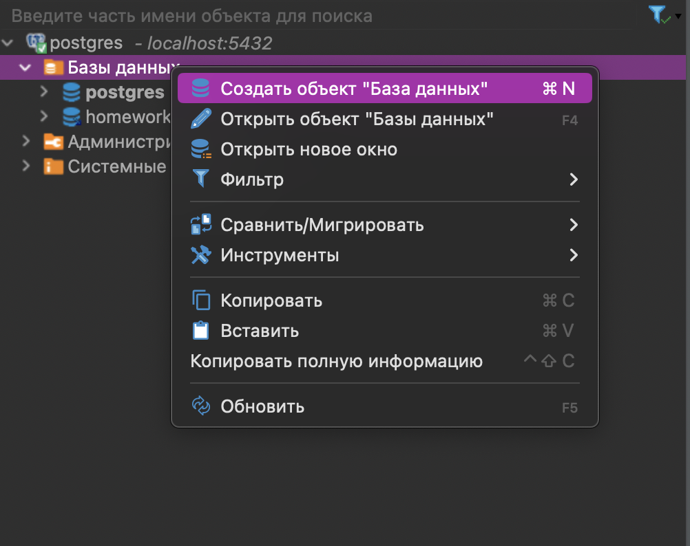

Затем откроется окно создания базы данных, в котором прописываем название базы данных (*homework_5*) и нажимаем ***Ок***.

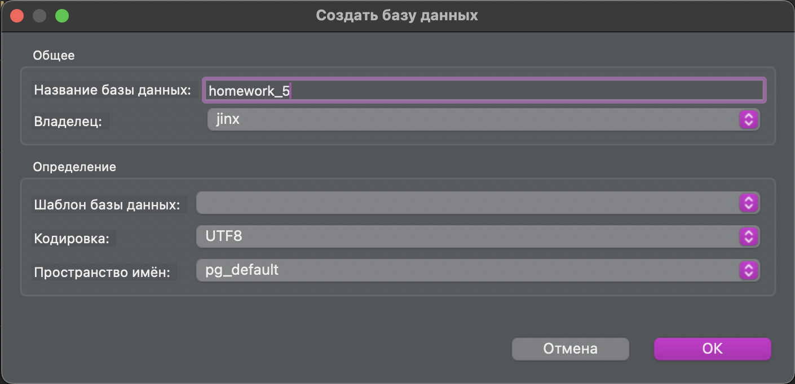

Теперь в разделе ***Базы данных*** должна появиться наша только что созданная база данных (*homework_5*).


---

## Создание таблиц для базы данных с помощью SQL

Необходимо создать таблицы для базы данных *Университет*.  
Добавим 5 таблиц: *"Факультеты", "Кафедры", "Группы студентов", "Студенты" и "Ведомость"*.

Чтобы вводить *SQL* запросы, необходимо нажать на кнопку ***Открыть скрипт SQL*** в верху экрана:


Откроется основное окно для ввода запросов, в котором вводим команды для создания таблиц:

```  
CREATE TABLE FACULTIES
(
    FACULTY_NAME VARCHAR(100),
	DEAN_FIO VARCHAR(100),
	ROOM_NUMBER INTEGER,
	BUILDING_NUMBER INTEGER,
	PHONE_NUMBER BIGINT
);
```
```
CREATE TABLE DEPARTMENTS
(
	DEPARTMENT_NAME VARCHAR(100),
	FACULTY VARCHAR(100),
	MANAGER_FULL_NAME VARCHAR(100),
	ROOM_NUMBER INTEGER,
	BUILDING_NUMBER INTEGER,
	PHONE_NUMBER BIGINT,
	TEACHER_COUNT INTEGER
);
```
```
CREATE TABLE STUDY_GROUPS
(
	DEPARTMENT_NAME VARCHAR(100),
	GROUP_NUMBER INTEGER,
	ADMISSION_YEAR INTEGER,
	STUDY_COURSE INTEGER,
	STUDENTS_NUMBER INTEGER
);
```
```
CREATE TABLE STUDENTS
(
	STUDENT_ID INTEGER,
	STUDENT_SURNAME VARCHAR(100),
	STUDENT_NAME VARCHAR(100),
	STUDENT_PATRONYMIC VARCHAR(100),
	GROUP_NUMBER INTEGER,
	GENDER VARCHAR(10),
	ADDRESS VARCHAR(100),
	CITY VARCHAR(100),
	PHONE_NUMBER BIGINT
);
```
```
CREATE TABLE PROGRESS
(
	GROUP_NUMBER INTEGER,
	STUDENT_ID INTEGER,
	SUBJECT VARCHAR(30),
	MARK INTEGER
);
```

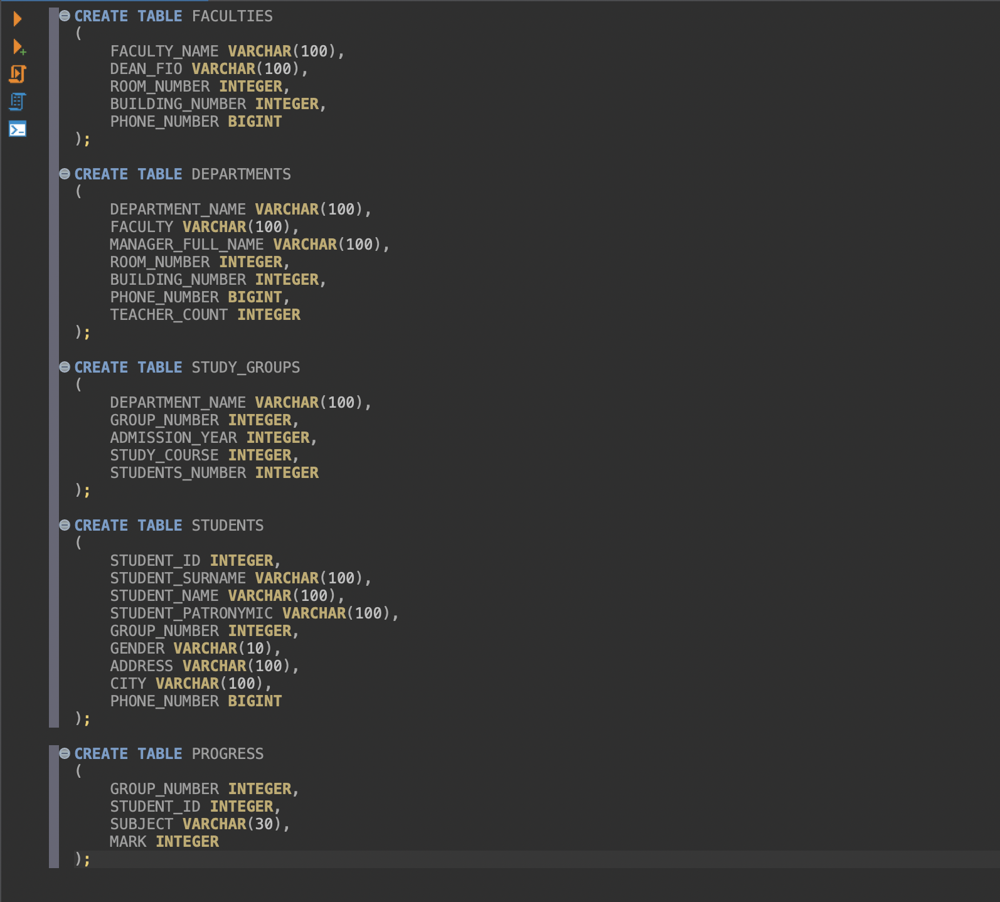

Чтобы выполнить запрос, нажимаем на кнопку на кнопку **▶** слева от окна с запросами *SQL*:

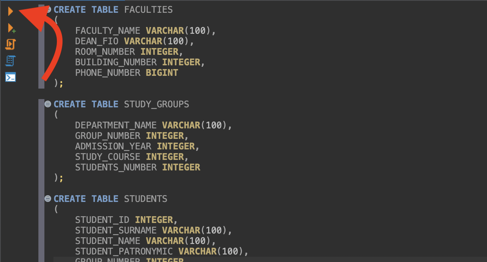

Либо можно использовать сочетание клавиш ( <i style="font-height: 20px; color: #FF8C00;">⌃↩</i> ).

Чтобы проверить успешно ли создались таблицы, нажимаем на ***название базы данных (homework_5)*** -> ***Схемы*** -> ***Public*** -> ***Таблицы***. В списке должны отобразиться все наши таблицы:

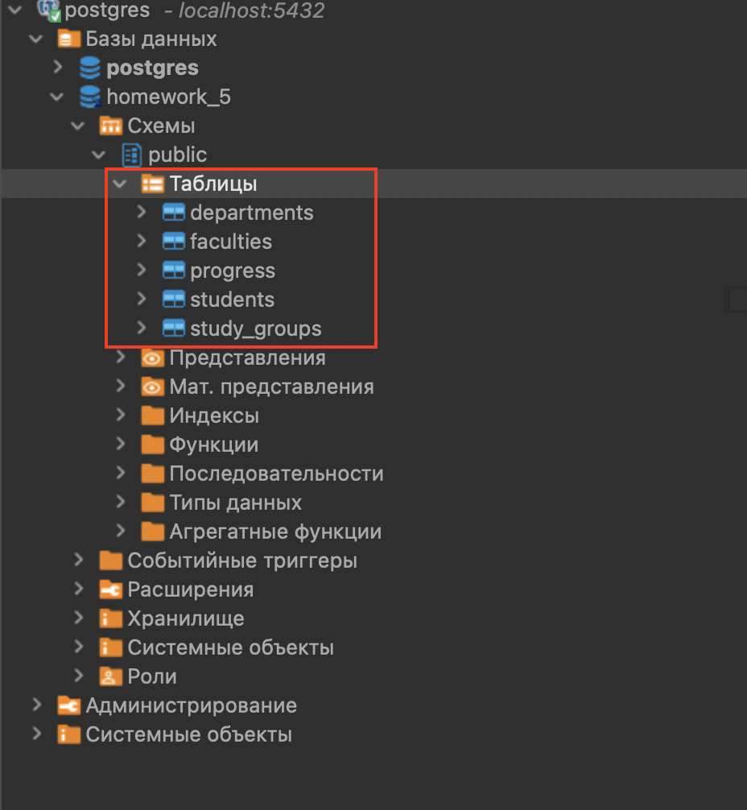

> Если запрос был выполнен успешно, а таблицы не появились, необходимо нажать правой кнопокой мыши по параметру ***Таблицы*** -> ***Обновить***.  
> 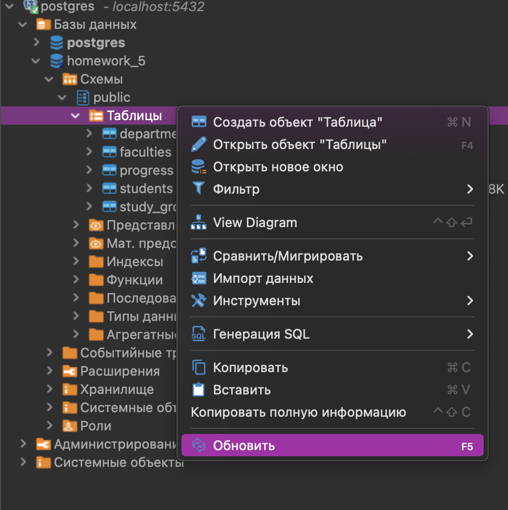

---

## Заполнение таблиц данными

Заполним данными каждую из таблиц. В окне ввода *SQL* запросов введем и выполним запрос:

```
INSERT INTO FACULTIES VALUES('HISTORY', 'SIDOROV N.V', 209, 2, 89656242971);

INSERT INTO DEPARTMENTS VALUES('HISTORY OF RUSSIA', 'HISTORY', 'IVANOV A.I', 156, 2, 89178234561, 7);

INSERT INTO STUDY_GROUPS VALUES('HISTORY OF RUSSIA', 143, 2020, 4, 20);

INSERT INTO STUDENTS VALUES(1, 'IVANOV', 'SERGEY', 'VLADIMIROVICH', 143, 'MALE', 'POBEDY AVENUE, 32', 'KAZAN', 89175328132);

INSERT INTO PROGRESS VALUES(143, 1, 'HISTORY OF RUSSIA', 5);
```


Аналогично добавляем побольше данных в наши таблицы. В результате должно получиться примерно так: 

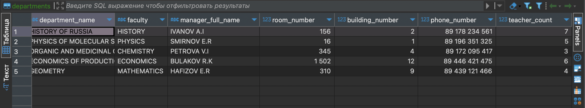
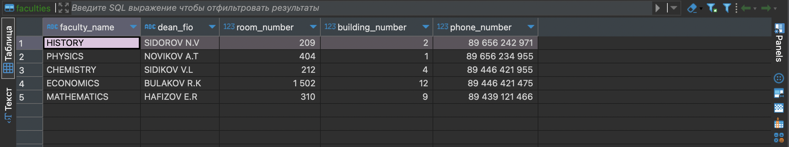

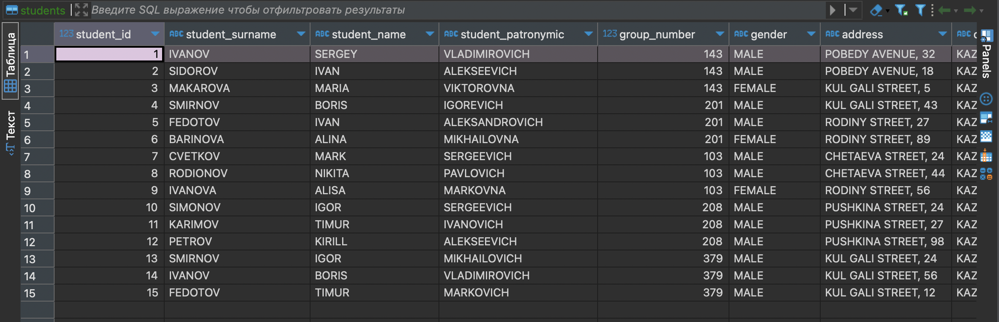
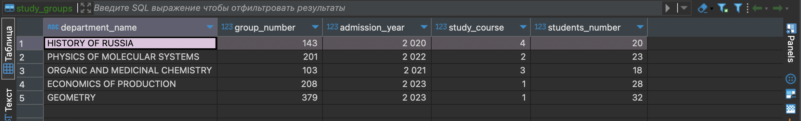

> Чтобы открыть таблицу, необходимо щёлкнуть левой кнопкой мыши по названию таблицы 2 раза.

---

## Установка связей между таблицами

Теперь необходимо установить связи между столбцами таблиц и другими таблицами с помощью внутренних и внешних ключей. Почитать про это можно [тут](https://metanit.com/sql/postgresql/2.5.php).

Вводим запросы в поле ввода *SQL* и выполняем:

```
ALTER TABLE FACULTIES
ADD CONSTRAINT unique_faculty_name UNIQUE (FACULTY_NAME);

ALTER TABLE DEPARTMENTS
ADD CONSTRAINT fk_department_faculty
FOREIGN KEY (FACULTY)
REFERENCES FACULTIES (FACULTY_NAME);

ALTER TABLE DEPARTMENTS
ADD CONSTRAINT unique_department_name UNIQUE (DEPARTMENT_NAME);

ALTER TABLE STUDY_GROUPS
ADD CONSTRAINT fk_department_id
FOREIGN KEY (DEPARTMENT_NAME)
REFERENCES DEPARTMENTS (DEPARTMENT_NAME);

ALTER TABLE STUDY_GROUPS
ADD CONSTRAINT uk_group_number
UNIQUE (GROUP_NUMBER);

ALTER TABLE STUDENTS
ADD CONSTRAINT fk_group_number
FOREIGN KEY (GROUP_NUMBER)
REFERENCES STUDY_GROUPS (GROUP_NUMBER);

ALTER TABLE PROGRESS
ADD CONSTRAINT fk_group_number
FOREIGN KEY (GROUP_NUMBER)
REFERENCES STUDY_GROUPS (GROUP_NUMBER);

ALTER TABLE STUDENTS
ADD CONSTRAINT uk_srtudent_id UNIQUE (STUDENT_ID);

ALTER TABLE PROGRESS
ADD CONSTRAINT fk_student_id
FOREIGN KEY (STUDENT_ID)
REFERENCES STUDENTS (STUDENT_ID);
```
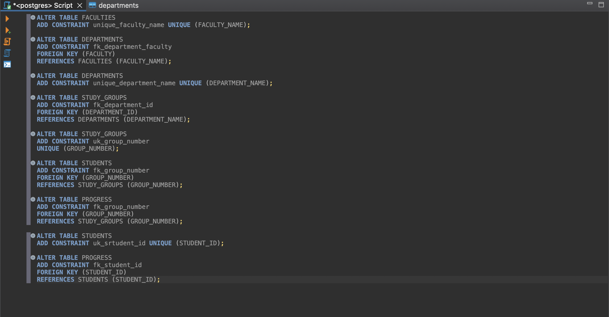

Чтобы посмотреть на установленные связи нажимаем на параметр ***Представления*** (***название базы данных (homework_5)*** -> ***Схемы*** -> ***Public***) правой кнопкой мыши -> ***Обновить***, затем выбираем там параметр ***View diagram***.

В открывшемся окне появится схема, которая показывает взаимосвязь между таблицы:

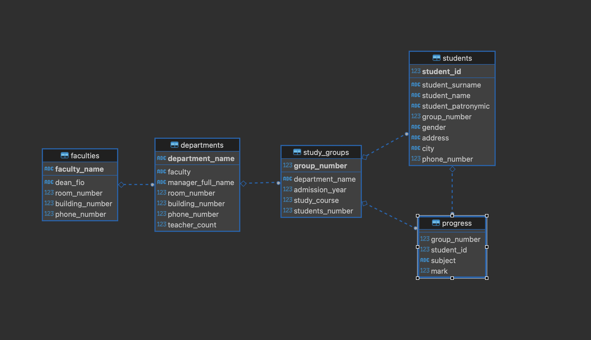

Также добавим индексы для таблиц: 

```
CREATE INDEX idx_department_faculty ON DEPARTMENTS (FACULTY);
CREATE INDEX idx_group_department ON STUDY_GROUPS (DEPARTMENT_NAME);
CREATE INDEX idx_student_group ON STUDENTS (GROUP_NUMBER);
CREATE INDEX idx_progress_group ON PROGRESS (GROUP_NUMBER);
CREATE INDEX idx_progress_student ON PROGRESS (STUDENT_ID);
```

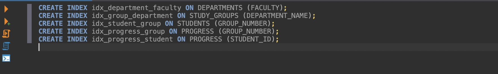

Чтобы посмотреть на все индексы, которые были созданы для таблиц, выполняем запрос: 

```
SELECT indexname AS index_name, tablename AS table_name
FROM pg_indexes
WHERE schemaname = 'public'; 
```

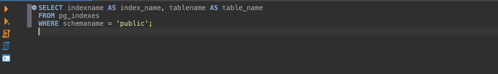

После выполнения запроса появится такая табличка:

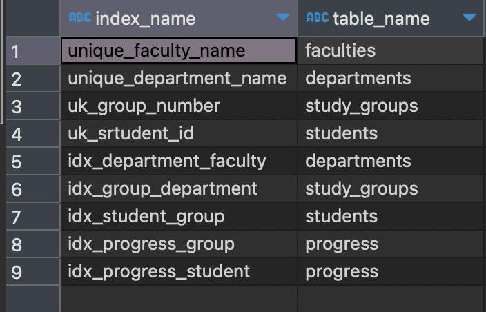

---

## Выполнение лабораторной работы №5

После выполнения всех предыдущих шагов у нас есть база данных  *"Университет"*, которая необходима для выполнения *"Лабораторной работы №5"*.

---

### Создание таблицы "STUDENT"

Создадим новую таблицу ***"STUDENT"*** с помощью запроса:

```
CREATE TABLE STUDENT (
    STUDENT_ID serial PRIMARY KEY,
    SUTNAME text NOT NULL,
    SUTFNAME text NOT NULL,
    STIPEND numeric(10, 2) CHECK (STIPEND < 500),
    COURSE smallint CHECK (COURSE >= 1 AND COURSE <= 5),
    CITY text,
    BIRTHDAY date,
    "GROUP" text,
    DEPARTMENT_NAME VARCHAR(100) REFERENCES DEPARTMENTS(DEPARTMENT_NAME)
);
```

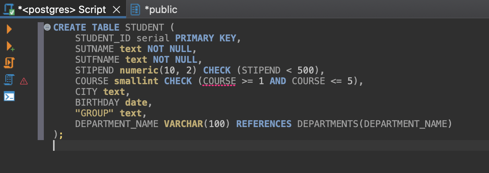

Заполним табличку значениями с помощью запроса:

```
INSERT INTO STUDENT (SUTNAME, SUTFNAME, STIPEND, COURSE, CITY, BIRTHDAY, "GROUP", DEPARTMENT_NAME)
VALUES
    ('Иванов', 'Иван', 450.00, 2, 'Москва', '1999-05-15', 'Группа 101', 'GEOMETRY'),
    ('Петров', 'Петр', 490.00, 3, 'Санкт-Петербург', '2000-03-20', 'Группа 102', 'PHYSICS OF MOLECULAR SYSTEMS'),
    ('Сидорова', 'Анна', 300.50, 1, 'Казань', '2001-07-10', 'Группа 103', 'HISTORY OF RUSSIA'),
    ('Козлов', 'Алексей', 480.75, 4, 'Екатеринбург', '1998-12-05', 'Группа 104', 'ECONOMICS OF PRODUCTION'),
    ('Смирнов', 'Ольга', 450.25, 5, 'Новосибирск', '1997-09-30', 'Группа 105', 'ORGANIC AND MEDICINAL CHEMISTRY');
```

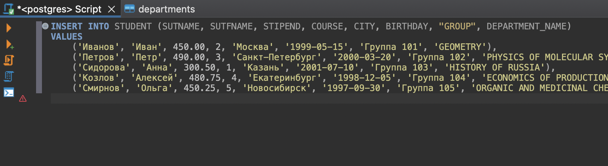

В результате получается такая табличка:

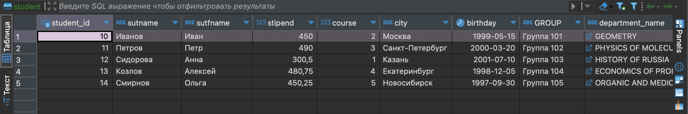

---

### Создание таблицы "TEACHER"

Создадим новую таблицу ***TEACHER*** с помощью запроса: 

```
CREATE TABLE TEACHER (
    KOD_TEACHER SERIAL PRIMARY KEY,
    DEPARTMENT_NAME VARCHAR(100) REFERENCES DEPARTMENTS(DEPARTMENT_NAME),
    NAME_TEACHER VARCHAR(255),
    INDEF_KOD INT UNIQUE,
    DOLGNOST VARCHAR(50) DEFAULT 'ассистент' CHECK (DOLGNOST IN ('профессор', 'доцент', 'старший преподаватель', 'ассистент')),
    ZVANIE VARCHAR(50) DEFAULT 'нет' CHECK (ZVANIE IN ('к.т.н', 'к.г.у', 'к.с.н', 'к.ф.м.н', 'д.т.н', 'д.г.у', 'д.с.н', 'д.ф.м.н', 'нет')),
    SALARY DECIMAL(10, 2) DEFAULT 1000 CHECK (SALARY > 0),
    RISE DECIMAL(10, 2) DEFAULT 0 CHECK (RISE >= 0),
    DATA_HIRE DATE DEFAULT CURRENT_DATE,
    BIRTHDAY DATE,
    POL CHAR(1) CHECK (POL IN ('ж', 'Ж', 'м', 'М')),
    TEL_TEACHER VARCHAR(12) CHECK (TEL_TEACHER ~ '^[1-9][0-9]-[0-9][0-9]-[0-9][0-9]$')
);
```

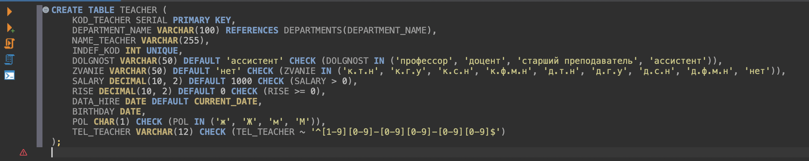

Заполним табличку значениями:

```
INSERT INTO TEACHER (DEPARTMENT_NAME, NAME_TEACHER, INDEF_KOD, DOLGNOST, ZVANIE, SALARY, RISE, BIRTHDAY, POL, TEL_TEACHER)
VALUES
    ('HISTORY OF RUSSIA', 'Иван Иванов', 1, 'профессор', 'к.т.н', 5000.00, 1000.00, '1980-05-15', 'м', '23-45-67'),
    ('ECONOMICS OF PRODUCTION', 'Мария Петрова', 2, 'доцент', 'к.ф.м.н', 4200.50, 800.25, '1975-08-20', 'ж', '34-56-78'),
    ('GEOMETRY', 'Алексей Сидоров', 3, 'ассистент', 'нет', 3000.00, 0.00, '1990-12-10', 'м', '45-67-89');
```

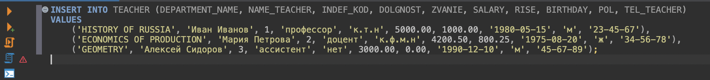

В результате получится такая табличка:

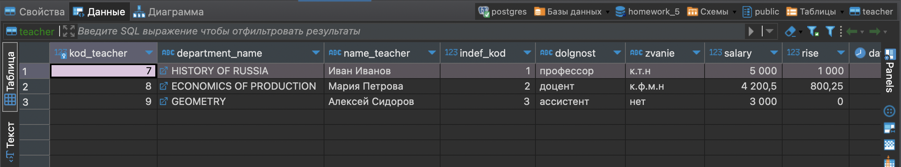

---

### ERD-схема

После выполнения всех шагов схема базы данных теперь выглядит таким образом:

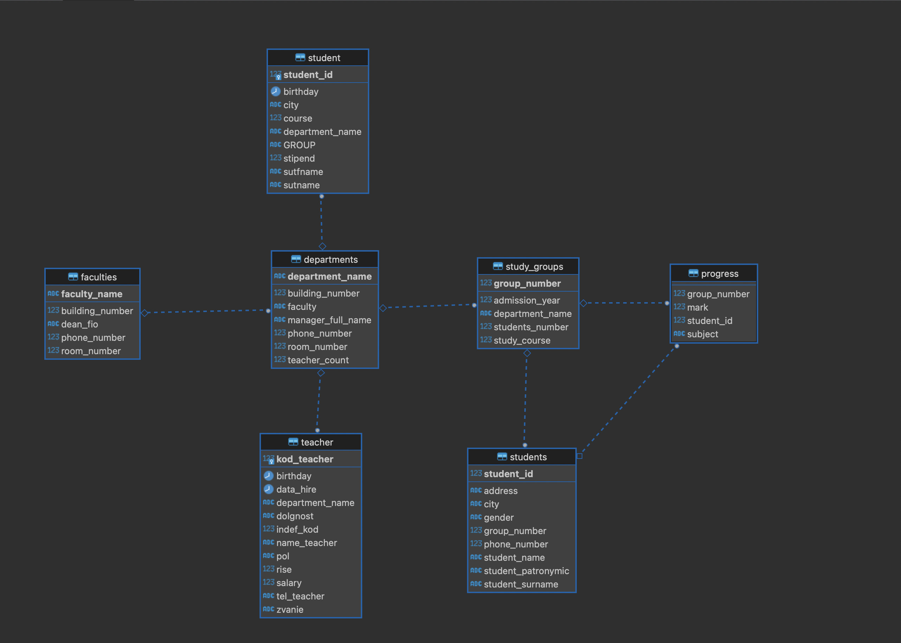